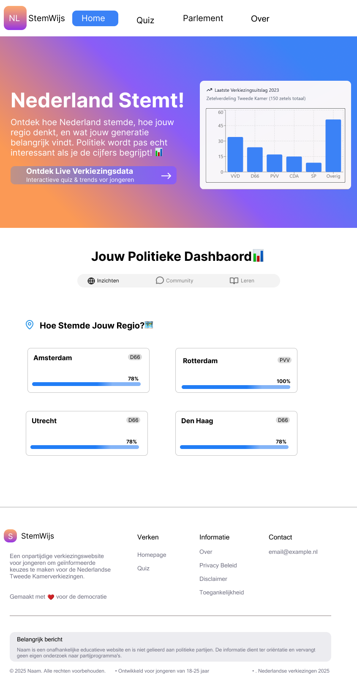
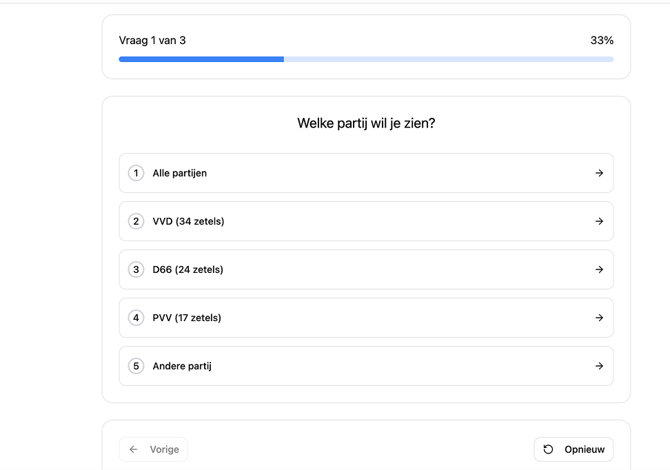
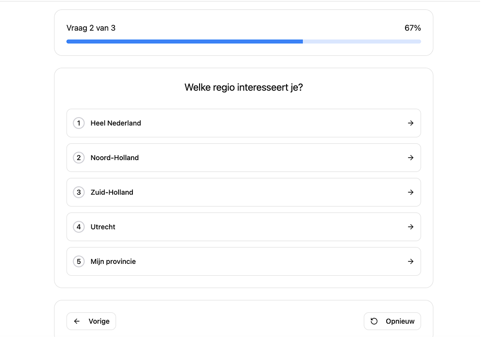
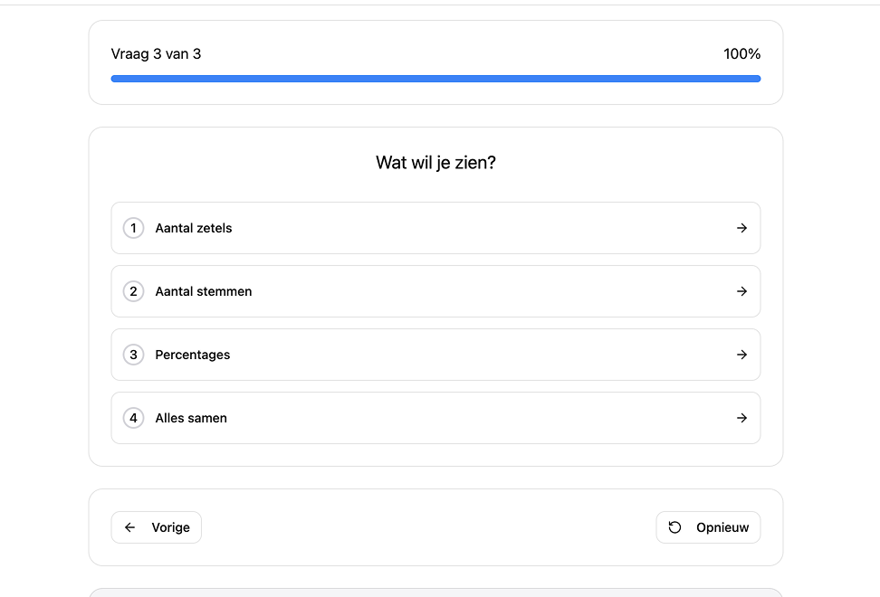
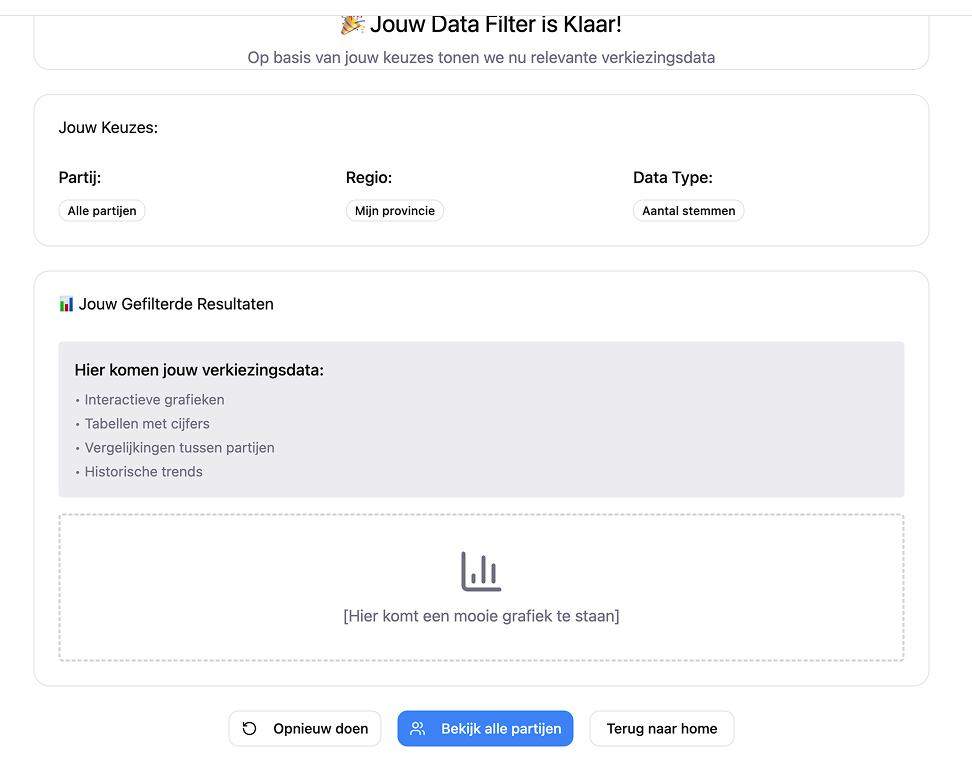
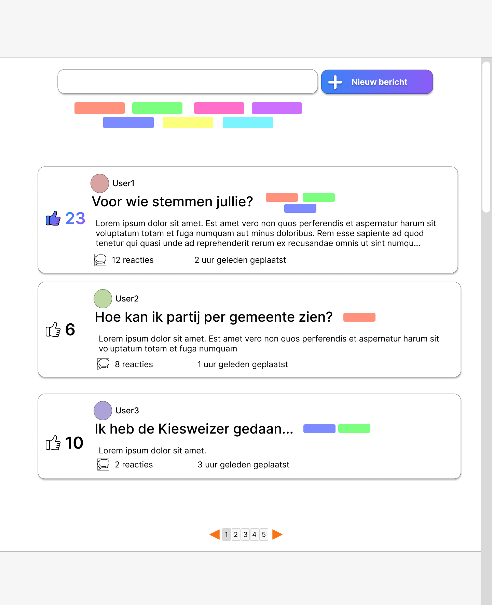
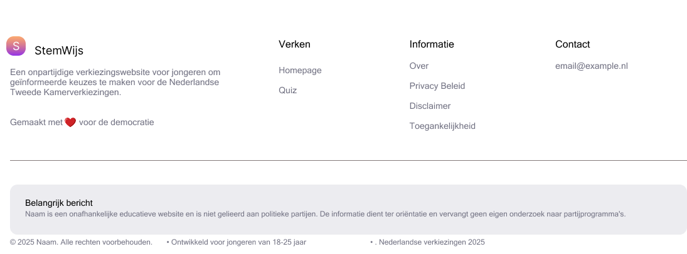

# Wireframes

Dit document bevat de huidige wireframes van de belangrijkste pagina’s en functionaliteiten van de applicatie. In de toekomst kunnen er nog meer wireframes en pagina’s worden toegevoegd naarmate de applicatie verder wordt ontwikkeld.

## Overzicht wireframes

### Home page
*Hier komt de wireframe van de Home page.*
Korte beschrijving: Centrale dashboard met verkiezingsresultaten, navigatie en tabbladen voor Insights, Community en Learn. Let op: hieronder staat slechts één afbeelding van de Home page. De homepage bevat in de functionaliteit ook toegang tot andere pagina's en onderdelen van de applicatie._

### Results page
*Hier komt de wireframe van de Results page.*
Korte beschrijving: Dit onderdeel bevat de filter- en quizfunctionaliteit voor het selecteren van data. Na het invullen van de quiz worden de resultaten gefilterd en toont het systeem alleen de data die relevant is voor de voorkeuren van de gebruiker.

### Forum page
_Korte beschrijving: Q&A forum waar gebruikers vragen kunnen stellen, antwoorden kunnen geven en posts kunnen upvoten._

### Navbar
_Korte beschrijving: Navigatiebalk bovenaan de pagina._

### Footer
_Korte beschrijving: Voettekst onderaan elke pagina met links naar contactinformatie, privacybeleid, en eventueel extra navigatie._

