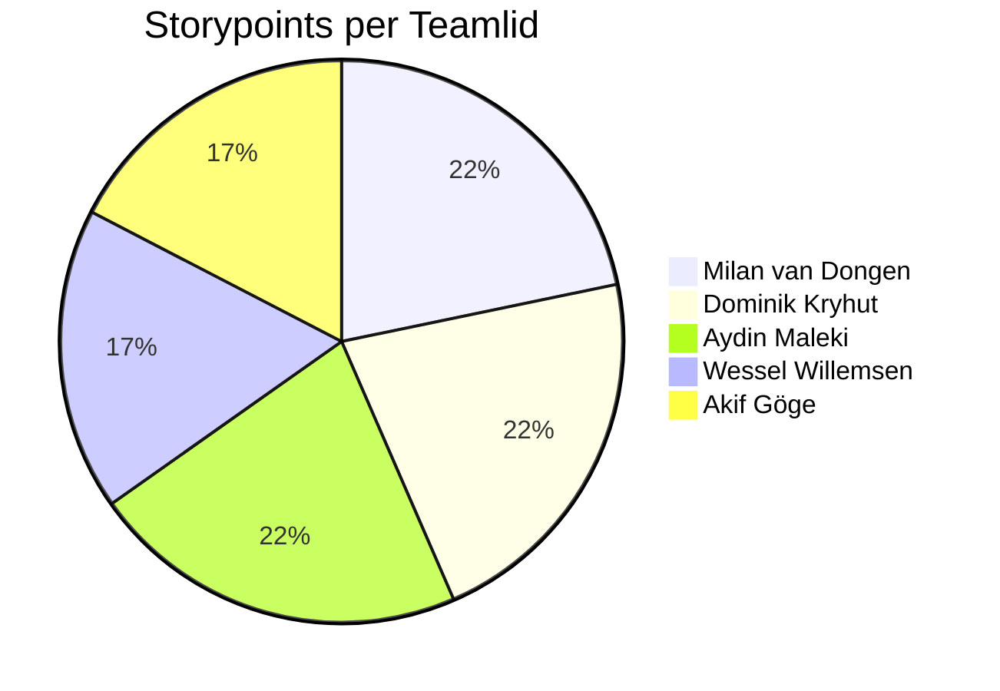

# Retrospective Sprint 1

We hebben de retrospective gedaan met behulp van de "Liked, Learned, Lacked " methode van [https://www.funretrospectives.com/the-3-ls-liked-learned-lacked/](https://www.funretrospectives.com/the-3-ls-liked-learned-lacked/).
## Uitkomst retrospective

Tijdens deze sprint hebben we als team vooral gefocust op het opzetten van de projectstructuur, het verzamelen van requirements en het leren werken met nieuwe technologieën zoals Spring Boot en Vue.js. De samenwerking en communicatie binnen het team waren goed, iedereen was aanwezig en er was een positieve groepsdynamiek. Taken zijn op tijd afgemaakt en er is veel geleerd over de benodigde technieken voor het project.

Verbeterpunten zijn het beter voorbereiden van gesprekken met de Product Owner, het vooraf maken van analyses, en het regelmatig delen van updates binnen het team. Ook willen we in de volgende sprint meer aandacht besteden aan het op tijd komen en het maken van een duidelijkere planning.

## Concrete verbeterpunten voor komende sprint
- PO gesprekken beter voorbereiden en gerichte vragen stellen
- Regelmatig updates delen binnen het team
- Duidelijkere planning en taken verdelen
- Analyse maken voorafgaand aan belangrijke meetings 

## Aandeel teamleden

Korte toelichting: De storypoints zijn redelijk gelijk verdeeld, met een lichte voorsprong voor Milan, Dominik en Aydin door extra inzet bij het opzetten van het project. De verschillen zijn te verklaren door de verdeling van taken.

## Feedback voor teamleden

### Milan van Dongen
#### Tops
- Je hebt snel door hoe dingen werken en dat helpt het team vooruit.
- Altijd op tijd, Behulpzaam, en vraagt op tijd als je vragen hebt.
- Je werkt zelfstandig en proactief.
- Heeft een groot verantwoordelijkheidsgevoel, je weet dat Milan serieus omgaat met de opdracht.
- Je kan zien dat je graag orde houdt in het team.
- Gaat steeds beter met presenteren.
 
#### Tips
- Misschien kun je de anderen nog wat meer meenemen in je aanpak, zodat we allemaal mee kunnen leren.
- Durf keuzes te maken en uit te leggen.
- Er zijn ups en downs. Geen zorgen als het even iets minder gaat, dit is normaal!
- Durf om hulp te vragen en je mening te geven over het project.

### Dominik Krystul
#### Tops
- Enthousiast begonnen en neemt initiatief in gesprekken.
- Veel moeite en inzet in het werk.
- Hardwerkend en betrouwbaar.
- Pakt dingen snel op en helpt graag het team → waardevol teamlid.
- Leert graag nieuwe technieken en deelt kennis met anderen.
- Altijd op tijd en toont een goede werkethos.

#### Tips
- Neem meer tijd om ideeën rustig en duidelijk uit te leggen.
- Oefen op een rustiger spreektempo.
- Peil vaker of anderen je uitleg begrijpen, in plaats van aannemen dat het al duidelijk is.

### Aydin Maleki
#### Tops
- Je bent enthousiast bezig en toont veel energie.
- Je bent leergierig, stelt vragen en wil graag leren.
- Je bent een harde werker en begrijpt Java goed.
- Je wilt snel werken en pakt dingen voortvarend aan.
- Je maakt vaak een grapje, wat zorgt voor een goede sfeer in het team.
 
#### Tips
- Geef een korte toelichting aan je team als je iets hebt afgerond, zodat iedereen weet hoe het werkt.
- Wees iets flexibeler bij veranderingen.
- Probeer meer te luisteren naar je teamleden.
- Houd het hele team up-to-date over de voortgang van het project.
- Geef ruimte aan teamleden om hun mening te geven bij grote veranderingen.

### Wessel Willemsen
#### Tops
- Je bent betrouwbaar en maakt afspraken die je ook nakomt.
- Je denkt altijd samen mee aan ideeën, en dat helpt echt.
- De presentatie zag er verzorgd en professioneel uit.
- Gefocussed bezig met het werk en commitment om alle doelen te behalen
#### Tips
- Misschien kan je net iets voor de les komen zodat we beter de dingen kunnen bespreken voor de les zodat we als groep een beter beeld krijgen.
- Probeer soms wat flexibeler te zijn en open te staan voor andere manieren van werken.
- Durf keuzes te maken en uit te leggen.
- Als je iets niet begrijpt laat dat eerder weten, zodat we elkaar gelijk kunnen helpen.

### Akif Göge
#### Tops
- Je luistert goed naar de anderen en zorgt dat iedereen zijn mening ka geven.
- Pro actief bezig, neemt taken op zich zelf
- Heeft leuke grapjes
- Kan goed werken en focussen
- Goed bezig met de stof die we moeten leren
#### Tips
- Je mag jezelf wat vaker laten horen en ook je eigen ideeën delen
- Lees de opdrachten goed door, want je had perongelijk alle challenges gemaakt van de shape opdracht
- Laat nog beter zien wat je kan. Ik denk dat je namelijk meer kan dan je ons laat zien.
- Soms iets serieuzer zijn in communicate over de chat
- Vaker de leiding nemen of input geven

## Eigen reflectie per teamlid

### Reflectie Milan van Dongen

#### **wat ging goed wat kan beter?**

goed:
⦁    Ik heb veel werk kunnen doen.
⦁    Mijn werk was goed gekeurd door de product owner

Verbeteringen:
⦁    Ik moet meer mijn mening uiten 
⦁    ik moet meer aandacht spenderen aan toelichten
⦁    Ik had me iets meer kunnen voorbereiden op de dingen die Philip had genoemd in de les

#### **SMART doel voor komende sprint**
Ik wil tijdens de weken tussen 18/9/2025-08/10/2025, meer mijn aanpak en keuzes toelichten. Ik zal dit doen tijdens de daily stand-ups en andere gesprekken met mijn team.
Ik zal aan het einde vragen aan mijn team stellen of ik genoeg mijn mening heb kunnen uiten. Ik zal ook mijn rol als Scrum master gebruiken om mensen meer toe te lichten.

### Reflectie Dominik Krystul

De afgelopen sprint heb ik als leerzaam en motiverend ervaren. Ik heb gemerkt dat goede communicatie en samenwerking binnen het team zorgen voor een positieve sfeer en productiviteit. Het opzetten van de projectstructuur en het werken met nieuwe technologieën zoals Spring Boot en Vue.js waren uitdagend, maar ik heb veel geleerd. Wel merkte ik dat ik soms te weinig voorbereid was op gesprekken met de Product Owner, waardoor ik niet altijd de juiste vragen stelde.

#### **Leerdoel voor komende sprint**
- Ik wil mijn communicatievaardigheden verbeteren door actief te luisteren naar mijn teamleden en mijn ideeën duidelijker te verwoorden. Dit ga ik doen door tijdens teamvergaderingen vaker vragen te stellen en feedback te vragen op mijn voorstellen. Ik stel mezelf als doel om dit in de komende sprint minstens drie keer te doen.

### Reflectie Aydin Maleki
Ik heb geleerd hoe ik een project kan opzetten met een backend in Java met Spring Boot en Maven, en een frontend in Vue. Ook heb ik geleerd hoe ik frameworks kan toevoegen aan een Vue-project, zoals Tailwind CSS en Vuetify. Daarnaast heb ik twee Java-projecten succesvol afgerond: de game-opdracht, waarbij ik TypeScript naar Java heb overgezet, en de shape-opdracht. Het expertgesprek ging ook goed en ik heb positieve feedback voor expertgesprek verder aan de persona gewerkt.

Bij de persona-opdracht ging het niet helemaal goed, omdat ik ChatGPT had gebruikt om de tekst te verbeteren en ik had alleen een tekstbestand had ingeleverd, terwijl er een bestand met foto  moest worden gemaakt. Dit moet ik nu zelf corrigeren. Daarnaast heb ik het stukje analyse niet volledig uitgevoerd, omdat het een teamopdracht was en we niet duidelijk hadden afgesproken wie welke taken zou oppakken.

#### Ontwikkel doel:
Plannen verbeteren
Ik wil leren om een betere planning te maken door een tool te vinden die goed bij mij past (bijvoorbeeld Trello of Notion). Ik ga dit de komende sprint testen door minimaal één tool actief te gebruiken voor het bijhouden van mijn taken en deadlines. Aan het einde van de sprint kan ik evalueren of deze tool mij heeft geholpen overzicht te houden en of ik mijn afspraken beter heb nagekomen.

#### **Leerdoel voor komende sprint**

### Reflectie Wessel Willemsen
Ik vond dat we al goed aan het plannen waren, maar dit kon alleen nog op een structureler manier. Bijvoorbeeld door user stories te maken in gitlab en deze te verdelen over de teamleden. Ook waren er dingen in het project gemaakt, waar niet iedereen van af wist. Hierdoor  lijkt het soms net alsof je erg veel mist. Het is denk ik ook nog erg fijn als mensen meer feedback durven te geven. Het is niet persoonlijk en hiervan kan je van elkaar leren. Het zou fijn zijn als we een planning krijgen vanuit de docenten die niet steeds wordt veranderd. Dit is al meerdere malen gemeld door medestudenten en mezelf. Daardoor hoop ik dat dit vanaf nu beter zal gaan, maar ik hou het wel goed in de gaten.

#### **SMART doel 1 – Flexibiliteit tonen**

Tijdens dit project wil ik meer openstaan voor andere manieren van werken. Dat betekent dat ik niet alleen mijn eigen aanpak inzet, maar ook luister naar de ideeën en werkwijzen van mijn teamgenoten. Ik geef ze de ruimte om hun eigen manier van werken te volgen en probeer hier flexibel op in te spelen. Om dit meetbaar te maken, vraag ik minimaal één keer per week feedback aan mijn teamgenoten. Zo kan ik nagaan of zij ervaren dat ik hen meer vrijheid geef en of dit daadwerkelijk bijdraagt aan een prettigere samenwerking. Binnen twee weken wil ik weten of mijn teamgenoten dit verschil merken. Als dat zo is, blijf ik dit gedrag volhouden voor de rest van het project. Als het nog niet genoeg wordt ervaren, ga ik na hoe ik dit verder kan verbeteren, bijvoorbeeld door nog actiever door te vragen of mijn eigen voorkeuren minder op te leggen. Op deze manier werk ik aan mijn flexibiliteit en draag ik bij aan een betere groepsdynamiek.

#### **SMART doel 2 – Vóór de les afstemmen en voorbereiden**

Een tweede aandachtspunt voor mij is dat het team graag vóór de les al kort met elkaar wil overleggen, zodat we gezamenlijk met een duidelijk overzicht aan de slag kunnen. Daarom neem ik tijdens dit project de verantwoordelijkheid om dit structureel te organiseren. Voor elke lesdag stuur ik een bericht in onze Teams-groep, waarin ik afstem waar en wanneer we elkaar iets eerder ontmoeten. Het doel is om dit bij minstens tachtig procent van de lessen te doen, zodat we vooraf al belangrijke zaken kunnen doorspreken. Dit is een haalbare actie, omdat het weinig tijd kost maar veel structuur oplevert. Na de eerste twee weken bespreek ik met het team of deze manier van werken bevalt en of het helpt om beter voorbereid aan de lessen te beginnen. Als dit positief wordt ervaren, blijf ik dit tot het einde van het project consequent doen.

### Reflectie Akif Göge

#### **Leerdoel voor komende sprint**
Ik wil vaker de leiding nemen of actief input geven tijdens teammeetings en gezamenlijke werkzaamheden.
Dit ga ik doen door in elke stand-up minimaal één keer mijn mening of idee te delen, en bij het plannen van taken
proactief een rol op mij te nemen. Aan het einde van de sprint evalueer ik of ik dit bij elke teammeeting heb gedaan en
vraag ik feedback aan mijn teamleden.

