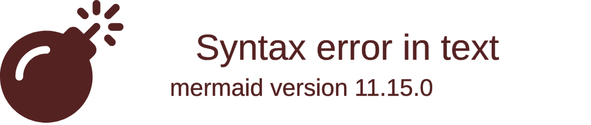

# Retrospective Sprint 2

We hebben de retrospective gedaan met behulp van de "Liked, Learned, Lacked " methode van [https://www.funretrospectives.com/the-3-ls-liked-learned-lacked/](https://www.funretrospectives.com/the-3-ls-liked-learned-lacked/).
## Uitkomst retrospective

---

### Uitkomst Retrospective

#### Sprint Goal
> Deliver a first working platform skeleton with homepage, authentication (login/registration), initial forum frontend, navigation bar, and footer, so users can move between features and perform basic actions.

#### Gemiste kansen en problemen
- **Transformer implementatie was moeilijk**
- Niet alle taken op het sprint board waren voltooid
- Te veel tijd besteed aan projectideeën buiten de user stories
- Geen TMC's uitgevoerd voor gebruikerstests
- Laatste userstory niet afgerond door te ambitieuze taken

#### Leerpunten (Wat hebben we geleerd?)
- Verticale slice maken met nieuwe tools en frameworks
- Database opzetten en opslaan via Hibernate
- Werken met Vue en XML-parser
- Beter functioneren binnen het team
- Communicatie met de Product Owner verbeterd

#### Positieve ervaringen
- Succesvolle transformer implementaties
- Goede planning en samenwerking in het team
- Behulpzaamheid en samenwerking bij vragen
- Efficiënte taakverdeling en afronding
- Veel werk succesvol afgerond

#### Overige reflectie

#### Terugblik op Retro Sprint 1
In de vorige sprint lag de focus vooral op het opzetten van de projectstructuur, het verzamelen van requirements en het leren werken met nieuwe technologieën zoals Spring Boot en Vue.js. We merkten toen dat de samenwerking en communicatie goed waren, maar dat er nog verbeterpunten lagen bij het voorbereiden van PO-gesprekken, het maken van analyses vooraf en het delen van updates binnen het team.

In Sprint 2 hebben we deze punten meegenomen door meer aandacht te besteden aan communicatie en het beter plannen van taken. Ook zijn we verder gegaan met het verdiepen in nieuwe tools en frameworks, en hebben we gewerkt aan een efficiëntere taakverdeling. Hierdoor zien we dat de samenwerking en het resultaat verder zijn verbeterd ten opzichte van Sprint 1, al blijven er aandachtspunten zoals het tijdig afronden van user stories en het uitvoeren van TMC's.

We blijven de verbeterpunten uit Sprint 1 meenemen in onze werkwijze, zodat we als team steeds effectiever en professioneler kunnen samenwerken.

We hebben opnieuw de Liked Learned Lacked retro gedaan. Over het algemeen vonden we het positief dat iedereen goed bezig was met de transformers en het verwerken van de XML parser. Dit zorgde ervoor dat we veel voortgang konden boeken op het sprint board en veel issues hebben afgerond.

Bij Learned hebben we veel geleerd over het werken met Vue, het koppelen van elkaars werk, en het werken met XML parsers en Spring Boot. Dit heeft ons als team sterker gemaakt in het samenwerken en het begrijpen van elkaars code.

Bij Lacked viel op dat niet alle user stories zijn afgerond en dat we geen TMC hebben gedaan, wat eigenlijk wel op de planning stond. Ook het prioriteren van de user stories kon beter; de belangrijkste taken moeten bovenaan staan zodat we daar als eerste aan werken.

Al met al was het een leerzame sprint met veel voortgang, maar er zijn ook duidelijke verbeterpunten voor de volgende sprint.

---

## Concrete verbeterpunten voor komende sprint
- Meer focus op het afronden van user stories en het tijdig uitvoeren van TMC's.
- Betere prioritering van taken op het sprint board, zodat de belangrijkste taken eerst worden opgepakt.
- Regelmatigere communicatie en afstemming binnen het team over voortgang en eventuele obstakels.

## Aandeel teamleden

**Korte toelichting:**

De verdeling van de storypoints is gebaseerd op de taken die in het sprint board zijn bijgehouden. Voor de transformer hebben we +5 storypoints meegeteld, ook al zijn daar geen aparte taken voor aangemaakt in Git. Dit geeft een beter beeld van de werkelijke inspanning. Het cijfer tussen haakjes is het totaal inclusief de transformer.

De andere teamleden hebben iets minder storypoints, omdat sommige taken niet zijn afgerond of omdat het issues met een lage waarde waren. Dit verklaart het verschil in de verdeling.

We zijn als team trots op elkaars inzet en bijdrage:
- Milan was bezig met het maken van het forum.
- Aydin heeft de registratie en login gebouwd met mock data.
- Wessel heeft de result page gemaakt met total votes en overzicht.
- Akif heeft de navbar en footer verzorgd.
- Dominik heeft de homepage gebouwd en de echte data geïntegreerd.
Iedereen heeft een waardevolle bijdrage geleverd aan het platform!

## Feedback voor teamleden

### Milan van Dongen
#### Tops
Ik heb goed werk geleverd, vooral met de transformer en het regelen van de database server. Ik houdt rekening met anderen, hecht waarde aan het teamgevoel en wil dingen goed begrijpen. Ik maak taken af, werk gemotiveerd en blijft verbeteren. Daarnaast ben ik flexibel bij veranderingen en communiceer ik duidelijk en open.
 
#### Tips
Ik moet proberen wat vaker hulp te vragen als iets niet duidelijk is, bijvoorbeeld bij Git als ik niet iets snap er zijn geen domme vragen. Ik moet wat meer communicren met het team en regelmatig overleggen.  Ik moet vaker mijn mening delen als ik ergens niet mee eens ben en betrokkenheid tonen bij het team doel

### Dominik Krystul
#### Tops
- Werkt heel hard en heeft me geholpen met mijn transformer. Technisch heel sterk.
- Betrekt iedereen uit het groepje in het project en heeft een goed overzicht van wat iedereen doet.
- Erg goed gefocust en heeft een goede werkhouding.
- Staat altijd klaar om teamgenoten te helpen, dit is erg waardevol! 
- Je werkt hard en helpt anderen als ze vragen hebben.
- Je bent eerlijk en transparant.
- Je houdt de voortgang goed bij.

#### Tips
- kan soms te dominant zijn in het maken van keuzes in de groep. 
- Als je het gevoel krijgt dat je te veel vooruit werkt, bedenk dan werk voor teamgenoten zodat je niet alles zelf doet. Of ga andere teamgenoten helpen om up to speed te komen.
- Soms neem je te veel werk op je; probeer de taken beter te verdelen binnen het team.
- Vermijd multitasking bij complexe features.

### Aydin Maleki
Milan:

aydin, top: altijd bereid om mij te helpen als ik een vraag heb. tip: heeft het laatste beetje van zijn vertical slice nog niet af gemaakt van de login

Wessel:

Aydin:

Tops:

Is heel goed in effectief samenwerken en blijft niet te lang haken in onbelangrijke dingen.

Heeft goede ideeën voor het project.

Is gezellig

Tips:

Laat nog meer weten aan het team waar je mee bezig bent, zodat dat duidelijk is voor iedereen. Soms vertel je dit namelijk 1 op 1 tegen een teamgenoot en krijg ik het niet helemaal mee.

Je bent goed bezig met de vooruitgang van andere groepjes / studenten buiten je eigen groepjes, deel dingen die je van anderen leert met je eigen groepje. Wanneer dit mogelijk is. 

Dominik:

Aydin Maleki:

Top: Ik vond het erg goed dat jij mij hebt geholpen met beetje tailwind.css framework te begrijpen, dankjewel daarvoor! Ook vind ik het goed van je dat je andere teamgenoten helpt als ze ergens vastlopen.

Tip: User Stories beter bijhouden, dus optijd afvinken enzo, dat is mijn feedback aan jou.

Akif:

Aydin

Top: Je draagt bij aan een veilige teamsfeer. Top: Je denkt vooruit over edge cases. Tip: Probeer meer best practices in je code te gebruiken

### Wessel Willemsen
#### Tops
- Altijd pro actief bezig in de team. Ga zo door. Ook vind ik het goed van je dat je insipratie opdoet van andere websites en teams.
- Is heel sterk in het team en luistert goed, bijvoorbeeld hij luisterde naar mijn feedback en zijn aanwezigheid nu perfect vergeleken met vorige retro.
- Je maakt duidelijke commits en merge requests
- Je zorgt voor een goede werksfeer.
- Je maakt duidelijke commits en merge requests
- Je zorgt voor een goede werksfeer.
#### Tips
- Voorkom dat werk blijft liggen aan het eind van de sprint.
 
- Kan misschien duidelijker zijn mening geven als het team iets besluit, zodat iedereen ook naar hem luistert.
 
- Houd je user stories regelmatig bij, dus optijd dingen afvinken en op tijd in verifying plaatsen. Als je dat gaat doen dan is het extra duidelijk voor andere teamleden hoe ver je bent.

### Akif Göge
#### Tops
- Goed van je dat je gelijk een open issue wilt overneemt zodra je zelf je issues af hebt gemaakt
- Je maakt je taken op tijd af en helpt anderen door feedback te geven op merge requests.
- Heel goed bezig met coderen en laat steeds weer zien dat je veel vooruitgang boekt.
- Altijd aanwezig
- Communiceert goed met het team via de chat
#### Tips
- heeft user story nog niet af
- Soms lijkt het alsof je niet actief meedoet in gesprekken die er worden gevoerd over het project.
- Probeer jezelf nog meer uit te spreken over dingen, zelfs als je er niet direct mee te maken hebt. Je mening kan waardevol zijn!
- Let beter op wanneer we in onze team een gesprek hebben, want je volgt het soms niet.
- Soms kom je een beetje laat op school door het openbaar vervoer.

---

## Eigen reflectie per teamlid

### Reflectie Milan van Dongen
Ik heb goed werk geleverd, vooral met de transformer en het regelen van de database server. Ik houdt rekening met anderen, hecht waarde aan het teamgevoel en wil dingen goed begrijpen. Ik maak taken af, werk gemotiveerd en blijf verbeteren. Daarnaast ben ik flexibel bij veranderingen en communiceer ik duidelijk en open.
Ik moet proberen wat vaker hulp te vragen als iets niet duidelijk is, bijvoorbeeld bij Git als ik niet iets snap er zijn geen domme vragen. Ik moet wat meer communicren met het team en regelmatig overleggen.  Ik moet vaker mijn mening delen als ik ergens niet mee eens ben en betrokkenheid tonen bij het team doel.

Vergeleken met de eerste feedback merk ik dat ik stappen heb gezet in het meenemen van anderen in mijn aanpak. Ik communiceer duidelijker en leg vaker uit wat ik doe, waardoor het team beter kan volgen. Ook durf ik sneller vragen te stellen als iets niet duidelijk is. Wat ik nog verder kan verbeteren, is mijn mening vaker actief delen en keuzes beter toelichten, zodat ik nog meer kan bijdragen aan de samenwerking in het team.

---

### Reflectie Dominik Krystul

Terugkijkend op mijn leerdoel van de vorige sprint het verbeteren van mijn communicatievaardigheden door actiever te luisteren, mijn ideeën duidelijker te verwoorden en vaker vragen te stellen — merk ik dat ik hier al stappen in heb gezet. Tijdens teamvergaderingen heb ik bewust vaker vragen gesteld en feedback gevraagd op mijn voorstellen. Dit heb ik zeker 2 keer gedaan. Ik merk dat dit heeft geholpen om de samenwerking en het begrip binnen het team te verbeteren. Het is nog steeds een aandachtspunt, maar ik ben tevreden met de progressie die ik heb gemaakt.

Ik vond de afgelopen sprint echt goed gaan. De taken werden duidelijk verdeeld binnen het team, waardoor iedereen lekker aan de slag kon. Tijdens deze sprint heb ik ook veel nieuwe dingen geleerd. Zo heb ik gewerkt met data parsing via een eigen transformer, wat ik erg interessant vond. Daarnaast heb ik kennisgemaakt met Vue, en dat vind ik echt een handig framework. In plaats van drie aparte bestanden voor HTML, CSS en JavaScript, staat nu alles overzichtelijk bij elkaar — dat werkt super prettig.

Ook heb ik zelf onderzoek gedaan naar SLF4J logging en dit toegepast in ons project. Dat gaf me een beter begrip van hoe je logging op een nette en consistente manier kunt implementeren. Verder verliep de communicatie met de Product Owner dit keer veel beter dan in eerdere sprints. Hij was tevreden met ons resultaat tijdens de sprint review, wat natuurlijk fijn was om te horen.

Wat nog beter kan, is de verdeling van taken binnen het team. Ik heb als feedback gekregen dat ik soms te veel initiatief neem en daardoor wat meer taken op me neem dan de rest. Volgende sprint wil ik hier beter op letten door meer te delegeren en het werk gelijkmatiger te verdelen.

#### **SMART doel voor komende sprint**

Voor de volgende sprint wil ik mij richten op het verbeteren van de taakverdeling binnen het team. Mijn doel is om beter te leren samenwerken door actief te zorgen dat alle teamleden evenredig bijdragen aan de sprinttaken. Dit ga ik doen door tijdens de sprintplanning bewust meer taken te verdelen in plaats van ze zelf op te pakken, en door iedere week minimaal één moment te plannen om samen te evalueren of de verdeling nog goed werkt. Het doel is haalbaar, omdat ik dit direct kan toepassen binnen onze werkwijze met sprints. Ik beschouw het leerdoel als behaald wanneer aan het einde van de sprint iedereen minstens twee eigen taken heeft afgerond en ik zelf merk dat ik minder werk naar me toe trek. Dit helpt niet alleen mij, maar ook het hele team om efficiënter en meer in balans samen te werken.

---

### Reflectie Aydin Maleki

Ik werk nog steeds aan mijn vorige doel om mijn planning te verbeteren. Ik heb een programma gevonden dat goed bij mij past: ClickUp. Dit helpt mij veel bij het plannen en overzicht houden van mijn taken. Dankzij ClickUp heb ik mijn taken deze sprint op tijd kunnen afronden, al wil ik nog leren om mijn taken beter te verdelen over de week.
Deze sprint verliep goed. Ik heb aan meerdere onderdelen gewerkt, waaronder de XML Parse de Transformer (mijn hoofdtaken binnen de backend). Daarnaast heb ik gewerkt aan de frontend voor de login- en registratiepagina. Wat beter kon, is dat ik bij de login- en registratiefunctie alleen de frontend heb gemaakt en geen dummy data in de backend heb toegevoegd. Ik dacht dat dit niet nodig was, omdat het niet in de user story stond. Voor de volgende sprint wil ik beter overleggen met mijn team en duidelijkere vragen stellen, zodat ik weet wat precies van mij wordt verwacht.

#### Ontwikkel doel:

Mijn nieuwe doel is om te leren werken met JPA, Hibernate, JWT, CORS en H2 in een Java Spring Boot-project, zodat ik beter begrijp hoe de backend en de database met elkaar communiceren. Ik wil dit aantonen door aan het einde van de volgende sprint een login en registeren te hebben waarin ik gebruikersdata opsla met JPA en Hibernate in H2, authenticatie toevoeg met JWT en correcte CORS-instellingen toepas. Dit doel is haalbaar, omdat ik al basiskennis heb van Spring Boot en Maven. Door documentatie te gebruiken en workshops te volgen en 
feedback van mijn team te vragen, verwacht ik dit doel binnen de volgende sprint te behalen.

---

### Reflectie Wessel Willemsen

Ik merk dat het team erg waardeert dat ik initiatief neem en actief meedenk. Vooral teamgenoten die zich normaal minder snel laten horen, ervaren dit als positief, omdat ik probeer iedereen te betrekken bij beslissingen en discussies. Ook wordt mijn consistentie in versiebeheer genoemd als een sterk punt — mijn duidelijke commit messages en merge requests zorgen voor overzicht en structuur binnen het team. Daarnaast ben ik me ervan bewust dat mijn aanwezigheid en betrokkenheid de afgelopen periode zijn verbeterd, wat de werksfeer ten goede komt.
Tegelijkertijd zie ik dat er nog ruimte is voor groei, vooral in het meer uitspreken van mijn mening tijdens groepsbeslissingen. Door mijn ideeën en standpunten eerder te delen, kan ik nog meer bijdragen aan de richting die het team opgaat en misverstanden voorkomen. Ook wil ik beter letten op het tijdig afronden en bijwerken van user stories, zodat de voortgang voor iedereen transparant blijft en er minder werk blijft liggen aan het einde van de sprint.
Al met al neem ik de feedback mee als bevestiging dat mijn inzet en communicatie gewaardeerd worden, maar ook als motivatie om mijn stem vaker te laten horen en mijn planning nog strakker te beheren.

#### **SMART doel voor komende sprint**

Ik wil in de komende sprint (van twee weken) actiever mijn mening en ideeën delen tijdens teamvergaderingen en beslissingsmomenten, zodat mijn visie op het project duidelijker wordt en de samenwerking soepeler verloopt.
Ik meet dit door na afloop van de sprint bij minimaal twee teamvergaderingen concreet input te hebben gegeven op beslissingen (bijvoorbeeld over takenverdeling, ontwerp of technische keuzes).
Daarnaast zorg ik ervoor dat mijn user stories wekelijks worden bijgewerkt en uiterlijk één dag voor de sprintreview in de juiste status staan (bijv. Verifying of Done).
Dit doel is haalbaar binnen de komende sprint en wordt als bereikt beschouwd wanneer mijn team bevestigt dat mijn bijdrage in de besluitvorming en transparantie rondom voortgang merkbaar is verbeterd.

---

### Reflectie Akif Göge
Tijdens sprint 1 was ik nog vooral bezig met het leren kennen van het project, het team en de werkwijze binnen onze scrumstructuur. Ik hield me toen vooral bezig met het begrijpen van de codebase en het oppakken van kleinere taken om feeling te krijgen met het proces. In sprint 2 merkte ik dat dit begon te veranderen: ik voelde me zekerder over mijn werk en durfde actiever mee te praten tijdens meetings en planningsmomenten.
 
Ik heb in deze sprint geprobeerd om meer initiatief te tonen en mijn ideeën te delen, iets waar ik in sprint 1 nog wat terughoudend in was. Dat ging steeds beter, vooral tijdens de stand-ups en retro. Voor de volgende sprint wil ik dit verder uitbouwen door ook buiten de meetings om vaker met teamleden te overleggen en mee te denken over verbeteringen in het proces.

#### **Leerdoel voor komende sprint**

Voor de volgende sprint stel ik als leerdoel dat ik bij elke teammeeting minimaal één keer actief input geef of een verbeteridee deel. Dit ga ik doen door me vooraf kort voor te bereiden op de stand-ups en retrospectives, zodat ik concreet kan bijdragen. Aan het einde van de sprint evalueer ik dit met mijn team en vraag ik feedback over mijn zichtbaarheid en betrokkenheid. Op die manier kan ik gericht werken aan het verder ontwikkelen van mijn communicatieve en proactieve vaardigheden binnen het scrumproces.

---

