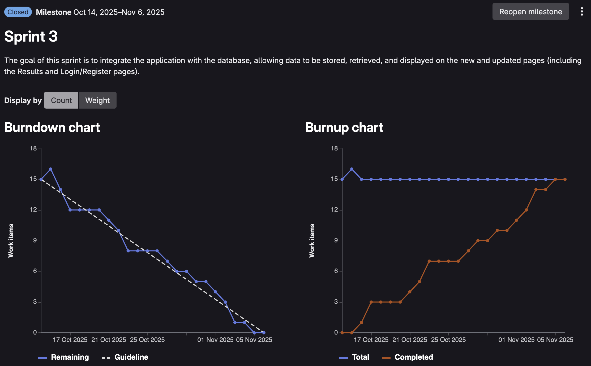

# Retrospective Sprint 3

We hebben de retrospective gedaan met behulp van de "Liked, Learned, Lacked" methode van [https://www.funretrospectives.com/the-3-ls-liked-learned-lacked/](https://www.funretrospectives.com/the-3-ls-liked-learned-lacked/).

---

### Uitkomst Retrospective

#### Sprint Goal
> The goal of this sprint is to integrate the application with the database, allowing data to be stored, retrieved, and displayed on the new and updated pages (including the Results and Login/Register pages).

**Sprint Goal Status: BEHAALD** Alle user stories voor deze sprint zijn succesvol afgerond.

#### Burndown Chart

We zijn zeer trots op onze burndown chart deze sprint. De grafiek laat zien dat we gedisciplineerd en consistent hebben gewerkt, waarbij we de planning goed hebben aangehouden en alle taken tijdig hebben afgerond.

#### Gemiste kansen en problemen
- Geen integration tests geïmplementeerd met code coverage
- Geen geautomatiseerde testrapportage in de CI/CD pipeline

#### Leerpunten (Wat hebben we geleerd?)
- **ORM met Hibernate/JPA**: Geleerd hoe we Object-Relational Mapping effectief kunnen inzetten om Java objecten te koppelen aan database tabellen
- **Database configuratie**: Ervaring opgedaan met zowel H2 (in-memory database voor development) als MySQL server in de development stage
- **Entity Design**: Geleerd hoe je JPA entities correct opzet met annotaties zoals `@Entity`, `@Id`, `@ManyToOne`, `@OneToMany`, en cascade types
- **JWT Authentication**: Implementatie van JSON Web Tokens voor veilige authenticatie en autorisatie
- **Database normalisatie**: Toegepast bij het refactoren van de Candidate tabel (verwijderen redundante party_name kolom)
- **Cascade deletion**: Geleerd hoe cascade types werken bij het verwijderen van gerelateerde entities (User → Posts → Comments)
- **Repository Pattern**: Werken met Spring Data JPA repositories en custom query methods
- **Database migratie**: Omgaan met verschillen tussen H2 en MySQL, vooral bij foreign key constraints

#### Positieve ervaringen
- **100% Sprint Goal behaald**: Alle geplande user stories zijn afgerond.
- **Excellente burndown chart**: De grafiek volgt bijna perfect de ideale lijn, wat wijst op goede planning en consistente voortgang
- **Sterke teamwork**: Iedereen heeft actief bijgedragen aan het integreren van de database
- **Succesvolle database integratie**: Data wordt nu correct opgeslagen, opgehaald en weergegeven op alle pagina's
- **Werkende authenticatie**: Login en registratie functioneren volledig met JWT tokens
- **Goede communicatie**: Team members hielpen elkaar goed bij complexe database issues en andere problemen.

#### Overige reflectie
Deze sprint laat een enorme progressie zien ten opzichte van Sprint 2. Waar we toen nog worstelden met het afronden van alle taken en geen TMC's uitvoerden, hebben we nu bewezen dat we als team een volwassen ontwikkelproces kunnen volgen. De burndown chart is daar het bewijs van.

De focus op database integratie heeft het hele team nieuwe technische vaardigheden gegeven. Iedereen heeft nu een solide begrip van ORM, JPA, en database design patterns. Dit vormt een sterke basis voor de komende sprints.

#### Terugblik op Retro Sprint 2
In Sprint 2 hebben we gefocust op het leveren van een werkend platform met homepage, authenticatie, forum frontend, navigatiebar en footer. We merkten toen dat de transformer implementatie uitdagend was en niet alle taken op het sprint board voltooid werden. Ook besteedden we te veel tijd aan projectideeën buiten de user stories en werden er geen TMC's uitgevoerd.

De positieve punten waren de succesvolle transformer implementaties, goede planning en samenwerking, en de verbeterde communicatie met de Product Owner. Als leerpunten namen we mee: het maken van verticale slices met nieuwe tools, database opzetten met Hibernate, en werken met Vue en XML-parser.

Voor Sprint 3 hebben we deze punten meegenomen door:
- **Betere prioritering**: Alle user stories waren duidelijk geprioriteerd en we hebben ons gefocust op de belangrijkste taken eerst
- **Realistische planning**: We hebben geleerd van Sprint 2 en meer realistische inschatting gemaakt van de werklast
- **Consistente voortgang**: Door dagelijkse stand-ups en goede taakverdeling hebben we een constante flow aangehouden
- **Focus op de sprint goal**: We zijn niet afgeweken naar 'leuke' features buiten de user stories, maar bleven gefocust op database integratie
- **Technische diepgang**: De ervaringen met Hibernate uit Sprint 2 hebben we nu volledig kunnen toepassen in productie

**Resultaat Sprint 3:**
Deze sprint was een groot succes. We hebben niet alleen alle user stories afgerond, maar ook aangetoond dat we als team de volwassenheid hebben om sprints voorspelbaar en succesvol te voltooien. 

De burndown chart spreekt boekdelen - bijna perfecte afstemming met de ideale lijn.

De database integratie is volledig werkend:
- Results pagina toont data uit de MySQL database
- Login/Register functionaliteit werkt met JWT authenticatie en BCrypt password hashing
- User profiles worden correct opgeslagen en opgehaald
- Forum posts en comments hebben volledige CRUD functionaliteit
- Cascade deletion werkt correct voor User → Posts → Comments

**Technische prestaties:**
- Succesvolle migratie van H2 naar MySQL voor production
- JPA relations en cascade types professioneel geïmplementeerd
- Clean repository pattern met custom queries
- Veilige authenticatie met JWT

---

## Concrete verbeterpunten voor komende sprint
- **Test Coverage implementeren**: Integratie van tests met code coverage monitoring.
- **Unit tests uitbreiden**: Meer test coverage voor service en repository layers
- **CI/CD pipeline verbeteren**: Geautomatiseerde tests toevoegen aan de pipeline
- **Performance monitoring**: Database query performance meten en optimaliseren waar nodig

## Aandeel teamleden

**Korte toelichting:**

De verdeling van de storypoints is gebaseerd op de afgeronde user stories op het sprint board. Iedereen heeft +3 storypoints gekregen voor het opzetten van database entities, repositories en models, aangezien we hiervoor geen aparte user stories of taken hadden aangemaakt in Git, terwijl dit wel een significante tijdsinvestering was.

**Toelichting op Dominik's lagere score:**
Dominik heeft relatief minder storypoints, wat komt door een planning poker foutje. De profiel pagina was één user story met weight 3, terwijl dit achteraf gezien beter verdeeld had moeten worden in meerdere kleinere stories:
- Email en gebruikersnaam wijzigen (aparte story)
- Wachtwoord wijzigen (aparte story)  
- Account verwijderen (aparte story)

Daarnaast heeft Dominik een extra feature toegevoegd aan de profiel pagina (bezoek tracking) waar geen user story aan gekoppeld was. Hierdoor kon deze waardevolle bijdrage niet worden meegeteld op het issue board, ondanks dat het technisch gezien wel extra werk was.

Ondanks het verschil in storypoints heeft iedereen een waardevolle en gelijkwaardige bijdrage geleverd aan deze sprint. De technische complexiteit van sommige taken (zoals JWT implementatie) is niet altijd volledig weerspiegeld in de storypoint verdeling.

---
## Feedback voor teamleden

### Milan van Dongen

#### Tops
- Levert consistent goed werk en behoudt goed overzicht.
- Denkt mee over de impact op de klant.
- Heeft oog voor detail in UX.
- Maakt leuke en sterke front-end oplossingen.
- Geeft regelmatig positieve en helpende feedback.

 
#### Tips
- Iets zorgvuldiger werken aan documentatie en code-opmaak.
- Durf je mening te geven, ook als anderen anders denken.
- Geef bij ziekte aan of je eventueel thuis kunt doorwerken, zodat het team weet waar je mee bezig bent.

### Dominik Krystul

#### Tops
- Super behulpzaam en neemt veel tijd om code uit te leggen.
Altijd super goed bereikbaar via Teams!
- Je bent eerlijk en transparant.
- Je neemt initiatief tijdens planningen.
- Je helpt anderen graag als ze ergens vastlopen.
- top je bent vaak aanwezig om te helpen als iemand een vraag heeft wat heel fijn is en helpt met het fixen van bugs. Ook neem je buiten je userstories opdrachten op jezelf om de website beter te maken en de code te refinen.

#### Tips
- Geef andere mensen soms iets meer ruimte om hun ideeen te geven over het project.
- Vermijd defensieve reacties op feedback.
- Houd rekening met schaalbaarheid. (user stories maken)
- Blijf werken aan je planning, zodat taken beter verdeeld worden en dat je juiste weight geeft aan userstory's.
- tip er was deze keer iets verkeerd gegaan met de verdeling van de weights, probeer hier volgende keer rekening mee te houden. vooral als je werk doet buiten de userstories maar dit niet genoteerd wordt

### Aydin Maleki

#### Tops
- Je levert grote bijdragen aan het project en helpt het goed vooruit.
- Technisch sterk: bijvoorbeeld het gebruik van JWT-tokens voor de workshop laat duidelijk zien dat je vaardig bent.
- Je test je code zorgvuldig en zorgt voor een goede werksfeer.
- Je humor draagt positief bij aan de teamsfeer.

#### Tips
- Neem meer tijd om bepaalde features te bespreken met alle teamleden, bijvoorbeeld tijdens de daily.
- Leg na afloop van je werk uit wat je aan de code hebt gedaan, zodat iedereen het begrijpt.
- Vraag vaker om feedback van anderen.
- Probeer soms professioneler te werk te gaan, want het kan soms lijken alsof je niet volledig meedoet met de groep.

### Wessel Willemsen

#### Tops
- Je bent eerlijk en transparant.
- Je communiceert professioneel.
- Je communiceert duidelijk en houdt het team goed op de hoogte.
- top je hebt aan twee moeilijke userstories af gemaakt en hebt daar buiten meer werk gedaan. Ook heb je hard in de vakantie gewerkt. In combinatie met je werk is het duidelijk dat je keihard werkt voor de studie.

#### Tips
- Vermijd te snel tevreden zijn met “werkt wel”.
- Wees assertiever bij meningsverschillen, maar blijf respectvol.
- Probeer  wat vaker om anderen te helpen.
- je vue is vrij moeilijk te begrijpen. het zou andere developers helpen als je de verschillende onderdelen van je pagina in hun eigen componenten doet.

### Akif Göge

#### Tops
- De jouw paginas hebben hele mooie grafieken dus goed oog voor detail
Je werkt zelfstandig en levert altijd op tijd op.
- Aardig en behulpzaam
Mooie feature opgeleverd deze sprint met vergelijken

#### Tips
- Uit meer je mening bij een groepsbeslissing
- Probeer iets vaker te communiceren over je voortgang
- Probeer zelf met ideeen te komen in plaats van te rekenen op anderen
- Leg soms wat uitgebreider uit waar je nou precies mee bezig bent en laat je niet onderbreken door andere

## Zelf reflectie

#### Dominik Krystul

**Terugblik op leerdoel Sprint 2:**

In Sprint 2 had ik mezelf het doel gesteld om de taakverdeling binnen het team te verbeteren. Mijn SMART doel was om tijdens de sprintplanning bewust meer taken te verdelen in plaats van ze zelf op te pakken, en wekelijks te evalueren of de verdeling goed werkte. Het doel was bereikt wanneer iedereen minstens twee eigen taken had afgerond en ik minder werk naar me toe zou trekken.

**Evaluatie Sprint 3:**

Kijkend naar Sprint 3 merk ik dat ik gedeeltelijk vooruitgang heb geboekt, maar er ook nog ruimte voor verbetering is. De feedback die ik heb ontvangen bevestigt dit beeld:

**Positieve ontwikkelingen:**
- Ik ben super behulpzaam gebleven en neem tijd om code uit te leggen aan teamgenoten, wat bijdraagt aan kennisdeling
- Ik ben goed bereikbaar via Teams en help actief bij het fixen van bugs
- Ik neem initiatief tijdens planningen en help anderen wanneer ze vastlopen
- Ik blijf eerlijk en transparant in mijn communicatie

**Aandachtspunten die terugkomen:**
Ondanks mijn goede intenties zie ik dat ik nog steeds de neiging heb om meer werk op me te nemen dan de rest. Dit blijkt uit:
- Het planning poker foutje waarbij de profiel pagina als één user story (weight 3) was ingepland, terwijl dit eigenlijk opgesplitst had moeten worden in meerdere kleinere stories (email/gebruikersnaam wijzigen, wachtwoord wijzigen, account verwijderen)
- Ik heb een extra feature (bezoek tracking) toegevoegd die niet aan een user story was gekoppeld, waardoor dit werk niet zichtbaar was op het board
- Feedback dat ik andere mensen soms iets meer ruimte moet geven om hun ideeën te delen over het project

**Wat heb ik geleerd deze sprint:**

Technisch gezien heb ik enorm veel geleerd over database integratie, JPA entities en JWT authenticatie. Ik heb succesvol de profiel pagina geïmplementeerd met volledige CRUD functionaliteit. Deze technische prestaties zijn waardevol, maar ik realiseer me dat ik ook moet leren om deze complexiteit beter te vertalen naar duidelijke, meetbare user stories.

Het belangrijkste inzicht is dat ik beter moet worden in het **schatten en opsplitsen van user stories**. Door een te grote user story aan te nemen (de profiel pagina) en daar nog extra features aan toe te voegen zonder dit te communiceren. 

**Concrete situaties waar het mis ging:**
1. Bij de sprintplanning had ik moeten voorstellen om de profiel pagina op te splitsen in drie aparte stories
2. Toen ik de bezoek tracking feature wilde toevoegen, had ik dit eerst met het team moeten bespreken en als aparte user story moeten registreren

**Hoe ga ik dit verbeteren:**

Voor de volgende sprint ga ik bewuster omgaan met planning en taakverdeling door:
1. **Tijdens sprintplanning**: Actief voorstellen om user stories op te splitsen in kleinere, beter definieerde taken
2. **Voor ik extra werk doe**: Eerst met het team bespreken of deze feature prioriteit heeft en een user story aanmaken voordat ik begin
3. **Wekelijkse check**: Elke woensdag tijdens de stand-up expliciet vragen of de taakverdeling nog goed is en of iemand hulp nodig heeft bij het vinden van interessant werk

#### **SMART doel voor komende sprint**

In Sprint 4 wil ik user stories beter inschatten en opsplitsen, en voorkomen dat ik werk oppak dat niet gekoppeld is aan een user story zonder dit eerst te bespreken met het team. Ik meet dit door tijdens de sprint planning minimaal één user story groter dan 5 story points actief voor te stellen om op te splitsen, en voordat ik extra werk toevoeg eerst een nieuwe issue aan te maken en dit te bespreken in de daily. Daarnaast check ik elke woensdag in de weekly of de taakverdeling nog klopt en noteer ik dit kort in de stand-up notes. Het doel is realistisch omdat ik concrete momenten heb waarop ik dit kan toepassen, en relevant omdat het bijdraagt aan een transparantere planning en betere samenwerking. Ik beschouw het doel als behaald als het team aangeeft dat de taakverdeling duidelijker is, mijn story points binnen 20 procent van de rest liggen, en al mijn werk zichtbaar gekoppeld is aan user stories op het board.

#### Reflectie Akif Göge
 
In deze sprint heb ik geprobeerd mijn eerdere leerdoel actief toe te passen: vaker input geven tijdens teammeetings en mijn ideeën delen over het proces. Ik merkte dat dit steeds natuurlijker ging, vooral doordat ik me vooraf beter voorbereidde op de stand-ups en retrospectives. Hierdoor kon ik gerichter bijdragen en werd mijn betrokkenheid binnen het team ook beter zichtbaar.
 
Wat ik vooral heb geleerd, is dat kleine bijdragen, zoals het delen van een suggestie of het stellen van een verduidelijkende vraag, al veel invloed hebben op de samenwerking. Ook buiten de meetings om heb ik vaker met teamleden overlegd, wat zorgde voor snellere afstemming en een beter overzicht van elkaars voortgang.
 
#### Leerdoel voor komende sprint
 
Voor de volgende sprint wil ik mijn focus leggen op samenwerking en kennisdeling. Concreet wil ik minimaal één keer per week een teamgenoot helpen of meedenken bij een taak waar ik zelf niet direct verantwoordelijk voor ben. Zo leer ik meer over verschillende onderdelen van het project en draag ik bij aan een sterker teamgevoel. Aan het einde van de sprint vraag ik feedback over mijn rol binnen de samenwerking, zodat ik kan blijven groeien in teamcommunicatie en onderlinge ondersteuning.

#### Reflectie Milan van Dongen

**Wat ging goed:**

- Ik heb dit semester veel werk kunnen maken en heb al mijn userstories af gemaakt.
- Ik heb meer positieve en helpende feedback gegeven blijkt uit mijn tops.
- Ik denk mee met het team blijkt uit de tops.
- Ik ben zeer versterkt met het gebruik van vue.

**Verbeteringen:**

- Documentatie blijft een grootte achterstand voor mij.
- Ik moet vaker mijn mening geven.
- Ik moet duidelijk aangeven waar ik aan werk wanneer ik ziek ben.

**Smartdoel 1:**

Ik wil tijdens de weken tussen 7/11/2025-26/11/2025, meer mijn aanpak en keuzes toelichten. Ik zal dit doen tijdens de daily stand-ups en andere gesprekken met mijn team.
Ik zal aan het einde vragen aan mijn team stellen of ik genoeg mijn mening heb kunnen uiten. Ik zal ook mijn rol als Scrum master gebruiken om mensen meer toe te lichten. 
(ik neem deze mee, omdat het duidelijk is dat ik dit nog niet heb behaald en dus aandacht moet besteden hieraan)

**Smartdoel 2:**
Ik wil tijdens de weken tussen 7 november 2025 en 26 november 2025 leren beter plannen, zodat ik genoeg tijd heb voor het maken van documentatie en het uitvoeren van testen. Ik heb mijn doel bereikt als ik aan het einde van de sprint al mijn userstories heb afgerond, mijn code een code coverage van minstens 50% heeft, en ik documentatie heb toegevoegd in zowel de front-end als de back-end. Dit doel is haalbaar binnen de sprintperiode.
hey sorry dat het iets later is
ik hoop dat dit goed is

#### Reflectie Aydin Maleki

In deze sprint heb ik gewerkt aan het inlog- en registratiegedeelte, inclusief JWT-authenticatie en de rolverdeling tussen gebruikers. Mijn planning is goed verlopen dankzij het gebruik van ClickUp, waarmee ik mijn taken duidelijk kon verdelen en op tijd afronden. Ook heb ik extra documentatie gemaakt, zoals een TMC-verslag, een ERD-diagram en een README-bestand over mijn code. Hierdoor heb ik een beter overzicht gekregen van mijn werk en kan ik mijn project makkelijker uitleggen aan anderen.

Als ik terugkijk naar mijn vorige leerdoel, merk ik dat ik veel vooruitgang heb. Ik heb geleerd hoe JPA, Hibernate en JWT samenwerken binnen een Java Spring Boot-project en ik heb dit kunnen toepassen in mijn code. Wel heb ik gemerkt dat ik me vooral heb gericht op de authenticatiekant en minder op andere onderdelen, zoals het verwerken van verkiezingsdata maar ik heb gewerkt aan de XML-parser.

Voor de volgende sprint wil ik mij verder ontwikkelen in het ophalen en tonen van verkiezingsdata. Mijn nieuwe leerdoel is om een interactieve quiz te maken waarin vaste vragen worden gesteld, en op basis van de antwoorden de juiste verkiezingsdata wordt getoond. Dit wil ik doen door logica toe te voegen die de data filtert op basis van de gegeven antwoorden.

**SMART-leerdoel:**
Aan het einde van de volgende sprint wil ik een werkende quiz hebben die verbonden is met de verkiezingsdata in de backend. Dit betekent dat gebruikers vragen kunnen beantwoorden en daarna direct de gefilterde verkiezingsinformatie zien. Ik bereik dit door binnen twee weken een basisversie van de quiz te bouwen, en in de laatste week te testen en feedback te vragen aan mijn team. Op die manier kan ik meten of mijn doel behaald is en of de data correct wordt weergegeven.

#### Reflectie Wessel Willemsen

De afgelopen periode hebben wij goed laten zien hoe je in een team samenwerkt. Ik ben erg blij met de dynamiek en de behulpzaamheid bij mijn teamgenoten die ik elk moment van de dag kan bereiken. Ook heb ik veel geleerd over programmeren met het project, Java, JPA, Hibernate, parsers, transformers, bepaalde dingen over de verkiezingen etc. Dit wil ik allemaal meenemen naar de volgende sprint. Nog even specifiek over wat ik vond dat er miste, is de nadruk leggen op hoe de gebruiker de website gaat ervaren. Nu hebben we een mooie overzichtelijke website gemaakt. Maar het zou nog  iets leuker gemaakt kunnen worden. Ik heb hier ook al een aantal ideëen voor en deze ga ik tijdens de sprintplanning met de PO vertellen. Daarnaast kan ik soms iets consistener committen. Dus dat ik elke dag een kleine portie van het werk doe in plaats van in een kleine periode meteen alle code eruit proberen te gooien. Qua aanwezigheid, motivatie en teamwerk vind ik dat het echt lekker gaat. Zie ook onze fllow/burnchart en teams gesprekken voor bewijs! 

Vorige sprintdoel heb ik goed bereikt je ziet  dat ik veel meer inspraak heb gehad over de user stories en dat ik eerder problemen heb aangekaart. Ook heb ik mijn issues goed op progress op het issue board gemaneged.
 
**Nieuwe SMART doel:**
Ik ga de komende sprint goed werken aan het  maken van gebruikerstests, omdat ik vind dat ik de website nog beter voor onze doelgroep kan maken. Dit ga ik doen door twee TMC cyclus uit te voeren, hierin betrek ik onze doelgroep van jongeren tussen de 18-24. De eerste twee weken wil ik er 1 per week af hebben en als er meer nodig zijn doe ik de week erop nog een.
 