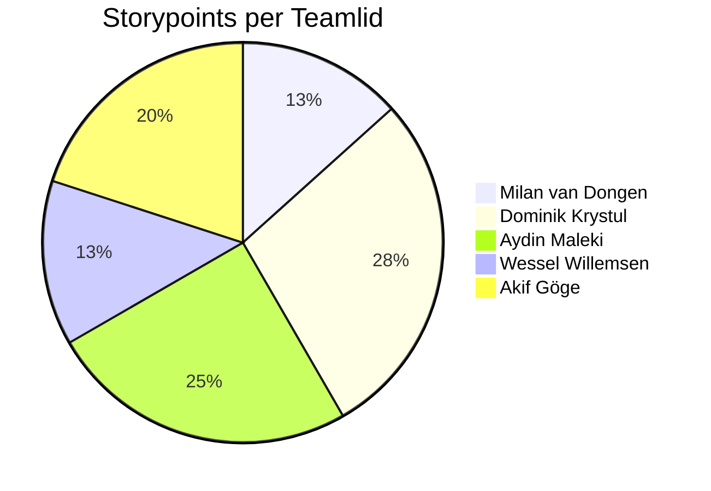

# Retrospective Sprint 4

We hebben de retrospective gedaan met behulp van de "Liked, Learned, Lacked" methode van [https://www.funretrospectives.com/the-3-ls-liked-learned-lacked/](https://www.funretrospectives.com/the-3-ls-liked-learned-lacked/).

## Uitkomst retrospective

---

### Uitkomst Retrospective

#### Sprint Goal
> Deliver essential platform functionality that enables secure user onboarding and interactive data exploration.

**Sprint Goal Status: GROTENDEELS BEHAALD** De kernfunctionaliteit is opgeleverd, maar 3 user stories zijn niet afgerond: één nieuws feature en twee Should have user stories. Alle Must have requirements zijn wel succesvol geïmplementeerd.

#### Gemiste kansen en problemen
- **3 user stories niet afgerond**: Één nieuws feature en twee Should have stories bleven open door tijdgebrek
- **Research opdracht in eerste week**: De eerste week van de sprint was gereserveerd voor de research opdracht, waardoor er minder tijd was voor ontwikkeling
- Niet alle code heeft volledige test coverage
- Tijdsinschatting rekening houdend met research week was te optimistisch

#### Leerpunten (Wat hebben we geleerd?)
- **Interactive Quiz Development**: Geleerd hoe je een dynamische quiz bouwt met Vue 3 en integratie met backend data filtering
- **Soft Deletion Pattern**: Implementatie van soft delete functionaliteit voor user accounts met reactivatie mogelijkheid
- **Component Composition**: Beter begrip van Vue component reusability en props/events systemen
- **Testing:** Tests zijn voor de meeste features geïntegreerd in het ontwikkelproces
- **Docker & Containerization**: Applicatie gecontaineriseerd met Docker en succesvol gedeployed naar productieomgeving
- **Server & DNS Management**: Eigen server opgezet en domein geconfigureerd voor live deployment

#### Positieve ervaringen
- **Sprint Goal grotendeels behaald**: Alle Must have functionaliteit is opgeleverd en werkend
- **Website succesvol live gezet**: We zijn enorm trots dat onze applicatie nu live draait. We hebben de volledige applicatie gecontaineriseerd met Docker, een eigen server gekocht, een domein geregistreerd en alles succesvol gedeployed naar productie
- **Sterke feature development**: Quiz, Learn Page en Forum enhancements zijn volledig werkend en getest
- **Goede prioritering**: Door focus op Must haves eerst, is de kernfunctionaliteit compleet
- **Goede code reviews**: Teamleden gaven elkaar constructieve feedback op merge requests
- **Proactieve planning**: Team heeft beter user stories opgesplitst na feedback uit Sprint 3

#### Overige reflectie

#### Terugblik op Retro Sprint 3
In Sprint 3 hebben we gefocust op database integratie, waarbij data correct werd opgeslagen, opgehaald en weergegeven op alle pagina's. We behaalden een perfecte burndown chart en voltooiden alle user stories, wat onze groei als team aantoonde.

De positieve punten waren de excellente burndown chart, sterke teamwork bij database integratie, succesvolle JWT authenticatie implementatie, en goede communicatie bij complexe issues. Als aandachtspunten namen we mee: test coverage verbeteren, CI/CD pipeline uitbreiden, en betere user story planning (vooral het opsplitsen van grote stories).

Voor Sprint 4 hebben we deze punten meegenomen door:
- **Betere story planning**: Dominik heeft tijdens sprint planning actief voorgesteld om grote stories op te splitsen
- **Focus op nieuwe features**: We hebben ons gericht op gebruikersgerichte features zoals de Quiz en Learn Page
- **Documentatie aandacht**: Meer technische documentatie toegevoegd (README_QUIZ_FEATURE.md, Index.md, project README.md)

**Resultaat Sprint 4:**
Deze sprint was grotendeels een succes met realisatie van de belangrijkste features, ondanks dat de eerste week gereserveerd was voor de research opdracht. Hoewel 3 user stories (1 nieuws feature en 2 Should haves) niet zijn afgerond door de beperkte beschikbare tijd, hebben we alle Must have functionaliteit geïmplementeerd en aangetoond dat we complexe, gebruikersgerichte functionaliteit kunnen bouwen. De openstaande issues worden meegenomen naar de volgende sprint.

De openstaande user stories worden ingehaald in de komende les vrije week.

**Belangrijkste realisaties:**
- **Interactive Quiz**: Volledig werkende quiz die verkiezingsdata filtert op basis van gebruikerskeuzes, met mooie visualisaties en CSV export functionaliteit
- **Email Verification Flow**: 4-cijferige code verificatie bij registratie voor extra beveiliging
- **Wachtwoord reset functionaliteit**: Gebruikers kunnen hun wachtwoord resetten via een beveiligde e-mail link
- **Forum Enhancement**: Tag mogelijkheid toegevoegd waardoor gebruikers tags kunnen plaatsen op hun posts
- **Soft Deletion**: Account verwijdering met mogelijkheid tot reactivatie, inclusief cascade behavior voor user content
- **UI/UX Improvements**: Verfijnde interfaces, betere responsive design, en verbeterde gebruikerservaring
- **Learn Page**: Uitgebreide educatieve pagina met 5 stappen die het Nederlandse politieke systeem uitlegt, compleet met smooth scrolling en hash-based sectie navigatie
- **Admin Panel**: Basis admin functionaliteit voor gebruikersbeheer en content moderatie

---

## Concrete verbeterpunten voor komende sprint
- **Betere planning bij externe opdrachten**: Rekening houden met beschikbare ontwikkeltijd wanneer een deel van de sprint voor andere opdrachten (zoals research) is gereserveerd
- **Test coverage verhogen**: Meer unit en integration tests schrijven voor nieuwe features
- **Performance optimalisatie**: Database queries optimaliseren en caching waar mogelijk toepassen
- **Accessibility verbeteren**: ARIA labels en misschien ook dark mode toevoegen

## Aandeel teamleden

**Korte toelichting:**

De verdeling van de storypoints is gebaseerd op de afgeronde user stories op het sprint board. Aydin heeft ietjes meer gedaan zoals: api documentatie geschreven en alle endpoints dynamisch gmeaakt.

Ondanks kleine verschillen in storypoints heeft iedereen een waardevolle en gelijkwaardige bijdrage geleverd.

---

## Feedback voor teamleden

### Milan van Dongen

#### Tops
- Levert consistent goed werk en houdt overzicht over de codebase
- Je forum tag filtering implementatie werkt uitstekend en is goed getest
- Je bent proactief in het helpen van teamgenoten
- Goede aandacht voor detail in UI/UX
- Je communiceert duidelijk over je voortgang in de daily stand-ups

#### Tips
- Probeer wat meer documentatie toe te voegen bij complexe features
- Durf nog meer je mening te geven tijdens technische discussies
- Blijf werken aan het tijdig afvinken van user stories op het board

### Dominik Krystul

#### Tops
- Goede time management skills
- Je had heel snel al je user stories af je werkte heel snel
- Staat altijd klaar voor het team
- Levert complete code
- Is kritisch op een manier waarop je het begrijpt
- Je helpt iedereen en zorgt dat iedereen zijn werk op tijd af heeft. Je maakt zelf ook altijd alles op tijd af.

#### Tips
- Kan duidelijker zijn in uitleg
- push jezelf niet te veel, probeer ook hulp te vragen aan anderen
- Geef aan als je ergens hulp bij nodig hebt, dan je hoeft niet teveel zelf te doen.
- Je neemt soms iets te veel werk, probeer de werkverdeling binnen het team beter te bewaken.

### Aydin Maleki

#### Tops
- Levert veel werk op en denkt proactief mee over professionele verbeteringen in het project.
- Sterk in het omgaan met data, wat goed zichtbaar is in de uitgewerkte user stories (zoals de quiz-userstory).
- Werkt goed mee met het team en vervult de rol van scrummaster effectief.

#### Tips
- Geef meer uitleg over hoe je dingen hebt gebouwd, zodat ook minder ervaren teamleden het goed begrijpen.
- Stel vaker vragen wanneer iets onduidelijk is.
- De Vue-componenten zijn soms te groot; het opsplitsen ervan kan de structuur en onderhoudbaarheid verbeteren.

### Wessel Willemsen

#### Tops
- Je werkt professioneel en netjes, en het werk dat je oplevert is echt goed.
- Geeft goede feedback en heeft belang bij de ontwikkeling van mensen in het team.
- Je bent proactief tijdens stand-ups.

#### Tips
- Probeer je planning nog verder te verbeteren, zodat alle user stories binnen de sprint afgerond kunnen worden.
- Probeer in je nieuwe front end component geen hard coded url's te gebruiken.
- soms te direct of bot bij het geven van feedback, waardoor het harder overkomt dan bedoeld.

### Akif Göge

#### Tops
- Je hebt al je user stories in een geleidelijke manier afgerond hoewel er onderzoek etc. was dus je kan goed plannen
- Is een stille kracht die zorgt voor degelijke features en is altijd aanwezig / op tijd.

#### Tips
- Probeer minder backend calls te maken op de admin page
- Laat jezelf meer horen in het team, dit is echt noodzakelijk want dat moet straks tijdens je werk nog veel meer.
---

## Eigen reflectie per teamlid

### Reflectie Milan van Dongen

## Wat ging goed:

- Ik heb deze sprint veel kunnen leren
- Ik heb hele goede communicatie met mijn team
- Ik heb bijna all leerdoelen opniveau

**Verbeteringen:**

- Ik heb te weinig tijd gepland voor mijn userstories

- Smart doel opnieuw omdat deze niet af was

Smartdoel 1:

Ik wil tijdens de weken van de laaste sprint leren beter plannen, zodat ik genoeg tijd heb voor het maken van documentatie en het uitvoeren van testen. Ik heb mijn doel bereikt als ik aan het einde van de sprint al mijn userstories heb afgerond, mijn code een code coverage van minstens 50% heeft, en ik documentatie heb toegevoegd in zowel de front-end als de back-end. Dit doel is haalbaar binnen de sprintperiode.

---

### Reflectie Dominik Krystul

**Terugblik op leerdoel Sprint 3:**

In Sprint 3 had ik mezelf het doel gesteld om beter te worden in het inschatten en opsplitsen van user stories, en te voorkomen dat ik werk oppak zonder dit te koppelen aan een user story. Mijn SMART doel was om tijdens sprint planning minimaal één grote user story (>5 story points) voor te stellen om op te splitsen, voordat ik extra werk toevoeg eerst een issue aan te maken, en elke woensdag te checken of de taakverdeling goed is.

**Evaluatie Sprint 4:**

Kijkend naar Sprint 4 zie ik duidelijke vooruitgang op het gebied van planning, maar ook dat externe factoren (research week) impact hadden op het eindresultaat.

**Positieve ontwikkelingen:**
- Ik heb actief tijdens de sprint planning voorgesteld om user stories op te splitsen in kleinere, beter definieerde taken. Zoals de admin panel. Die is opgesplitst in 4 aparte kleinere stories.
- All mijn werk was gekoppeld aan user stories op het issue board geen "hidden work" meer zoals in Sprint 3
- Ik heb mijn taken snel afgerond ondanks de research opdracht in week 1, wat goede time management laat zien
- De feedback bevestigt dat ik consistent goed werk lever en altijd klaar sta voor het team
- Ik help actief teamgenoten en zorg dat iedereen zijn werk op tijd af heeft

**Aandachtspunten die blijven terugkomen:**
- Ik neem nog steeds te veel werk op me
- Feedback dat ik mezelf niet te veel moet pushen en ook hulp moet vragen aan anderen
- Ik kan soms onduidelijk zijn in mijn uitleg naar teamgenoten

**Wat heb ik geleerd deze sprint:**

Technisch gezien heb ik complexe features succesvol geïmplementeerd zoals de email verificatie flow met 4-cijferige code, wachtwoord reset functionaliteit, en soft deletion met reactivatie mogelijkheid. Ik heb ook gewerkt met **lambda expressions** in de codebase, vooral in service layers.

**Concrete situaties waar het beter ging:**
1. Bij de sprint planning heb ik actief voorgesteld om grote stories op te splitsen - dit komt terug in de retrospective
2. Al mijn werk was zichtbaar op het issue board
3. Ik heb geen extra features toegevoegd zonder dit te communiceren

**Concrete situaties waar het nog beter kan:**
1. Wanneer teamleden hulp aanboden, had ik dit vaker moeten accepteren in plaats van alles zelf af te willen maken
2. Bij uitleg van complexe code (soft deletion en DB caching) had ik meer tijd kunnen nemen om dit stap-voor-stap door te nemen

**Hoe ga ik dit verbeteren:**

Voor de volgende sprint ga ik bewuster de teambalans bewaken:

1. **Actief hulp vragen**: Minimaal 1x per sprint expliciet aan een teamgenoot vragen om samen aan een feature te werken (pair programming)
2. **Uitleg verbeteren**: Bij het reviewen van code, korte inline comments toevoegen die de logica uitleggen
3. **Weekly balance check**: Elke woensdag niet alleen vragen of anderen hulp nodig hebben

#### **SMART doel voor komende sprint**

Tijdens de komende sprint wil ik mijn samenwerking en kennisdeling verbeteren door minimaal één keer per week actief een teamgenoot te helpen met een technische uitdaging, en bij elke code review van mijn eigen werk minimaal drie duidelijke uitlegcomments toe te voegen. Ik beschouw het doel als behaald als ik drie keer een teamgenoot heb geholpen met .
Tijdens de komende sprint wil ik mijn samenwerking en kennisdeling verbeteren door minimaal één keer per week actief een teamgenoot te helpen met een technische uitdaging, en bij elke code review van mijn eigen werk minimaal drie duidelijke uitlegcomments toe te voegen. Ik beschouw het doel als behaald als ik drie keer een teamgenoot heb geholpen met een technische vraag of probleem, en mijn team aangeeft dat mijn uitleg en samenwerking zijn verbeterd.
---

### Reflectie Akif Göge

In deze sprint heb ik vooral gefocust op mijn rol binnen het teamproces en mijn bijdrage aan de voortgang van de sprint. Ik merkte dat ik steeds beter werd in het tijdig communiceren van blockers en voortgang, waardoor het team sneller kon schakelen wanneer iets dreigde vast te lopen. Daarnaast heb ik bewuster gewerkt met onze Scrum-afspraken, zoals het actief updaten van mijn taken in de board, waardoor de transparantie in het team verbeterde.
 
**Leerdoel over komende sprint:**
 
Een belangrijk inzicht dat ik heb opgedaan, is dat duidelijke en consistente communicatie een grote invloed heeft op de efficiëntie van het team. Door vaker korte overleggen te doen met teamleden, voorkwamen we misverstanden en konden we sneller gezamenlijk besluiten nemen. Ook heb ik gemerkt dat ik meer vertrouwen kreeg in het zelfstandig oppakken van grotere taken, omdat ik beter wist wanneer ik hulp moest inschakelen.

---

### Reflectie Aydin Maleki

In deze sprint heb ik mijn leerdoel behaald. Ik heb de volledige quizfunctionaliteit gebouwd en uitgebreid met extra features zoals het exporteren van resultaten naar CSV en het kunnen kiezen van het verschillende verkiezingsjaar. Daarnaast heb ik het hele project gedeployed: ik heb een domein en server geregeld en ervoor gezorgd dat onze applicatie live draait. Dit was een belangrijk onderdeel, omdat het team nu een werkende productieomgeving heeft om mee te testen.

Verder heb ik documentatie geschreven, tests toegevoegd en hardcoded API-urls vervangen door dynamische variabelen via .env, zodat de code beter schaalbaar en onderhoudbaar is. Hierdoor voelt het project veel beter en toekomstbestendig aan.

Als ik terugkijk, ben ik tevreden met mijn inzet en de hoeveelheid werk die ik heb verzet. Ik heb veel technische problemen opgelost en echt stappen gezet in  deployment.

Voor de volgende sprint wil ik mezelf verbeteren op teamniveau. Ik wil actiever mijn teamgenoten helpen, meer samenwerken en nog één extra TMC-verslag maken om mijn leerproces beter te structureren. Dit helpt mij én mijn team om meer consistent te werken.

SMART-leerdoel:

Aan het einde van de volgende sprint wil ik mijn teamwork en documentatie verbeteren. Ik doe dit door elke week minimaal één moment in te plannen om actief een teamgenoot te helpen en door een extra TMC-verslag te schrijven. Dit is meetbaar doordat mijn bijdragen zichtbaar zijn in ClickUp en doordat mijn team aangeeft dat de samenwerking soepeler verloopt.

---

### Reflectie Wessel Willemsen

Uit de ontvangen feedback haal ik dat mijn team mijn inzet, professionaliteit en snelheid van werken waardeert. Ik hoor terug dat ik proactief ben tijdens stand-ups, goed overzicht houd over mijn taken en anderen ondersteun met duidelijke en waardevolle feedback. Ook wordt benadrukt dat het werk dat ik oplever kwalitatief sterk is en dat ik me inzet voor de ontwikkeling van anderen binnen het team. Dit bevestigt voor mij dat mijn bijdrage zichtbaar is en een positieve impact heeft.

Tegelijkertijd krijg ik duidelijke verbeterpunten mee. Een van de belangrijkste is dat ik soms te direct of bot kan overkomen bij het geven van feedback. Hoewel mijn intentie is om eerlijk en duidelijk te zijn, begrijp ik dat de manier waarop ik dit formuleer soms harder kan vallen dan bedoeld. Hier wil ik bewust mee omgaan door vaker te checken hoe iets overkomt en mijn feedback constructiever te verpakken.

Daarnaast wordt genoemd dat ik soms te veel werk naar me toe trek of mezelf te hard push. Dit kan ervoor zorgen dat de werkverdeling minder goed bewaakt wordt en dat ik te weinig gebruikmaak van de kracht van het team. Ik wil hier beter op letten door meer taken te delen en zelf ook sneller om hulp te vragen wanneer dat nodig is.

Ook op het gebied van planning en time management valt er nog winst te behalen. Hoewel ik regelmatig snel ben met mijn user stories, is er een situatie geweest waarin een story nog niet af was. Dit laat zien dat snelheid niet hetzelfde is als planning. Ik wil mijn inschattingen verbeteren en consequenter mijn voortgang communiceren, zodat het team altijd duidelijkheid heeft.

Verder zijn er enkele technische aandachtspunten die ik meeneem: het vermijden van hardcoded URLs, het maken van kleinere Vue-componenten, het beperken van onnodige backend calls en zorgvuldiger testen voordat ik code push. Deze punten helpen mij om mijn technische kwaliteit verder te verbeteren.

Samengevat laat de feedback zien dat ik sterk ben in inzet, verantwoordelijkheid, communicatie tijdens stand-ups en het ondersteunen van mijn team, maar dat ik nog kan groeien in zachter formuleren van feedback, beter taakbeheer, helderder communiceren en bewuster omgaan met technische best practices. Deze verbeterpunten neem ik mee om niet alleen zelf beter te worden, maar ook om het team beter te laten functioneren.

**SMART-leerdoelen voor de komende sprint:**
1. In de komende sprint ga ik actief werken aan het zachter en constructiever formuleren van mijn feedback. Bij elke merge request die ik review benoem ik bewust eerst iets positiefs voordat ik een verbeterpunt aangeef. Dit is haalbaar, omdat ik regelmatig merge requests bekijk en het weinig extra tijd kost. Door deze aanpak tijdens de hele sprint consequent vol te houden, wil ik bereiken dat mijn team mijn feedback als vriendelijker ervaart en duidelijk aangeeft dat de manier waarop ik mijn opmerkingen breng verbeterd is.

2. Tijdens de volgende sprint richt ik me op een betere taakverdeling door niet meer dan twee user stories tegelijk op te pakken. Dit helpt mij om overzicht te houden en voorkomt dat ik teveel werk naar me toe trek. Dit doel is goed uitvoerbaar binnen de sprint en past bij de manier waarop ons team werkt. Ik houd deze grens gedurende de hele sprint aan, en het doel is geslaagd wanneer mijn werk in het board zichtbaar binnen deze limiet blijft en de teamverdeling rustiger en evenwichtiger verloopt.

3. In de komende sprint wil ik mijn planning verbeteren door mijn user stories regelmatig bij te werken en de voortgang minimaal drie keer per week te updaten. Dit zorgt voor meer transparantie richting het team en helpt mij om mijn stories op tijd af te ronden. Het is realistisch, omdat het weinig tijd kost en goed aansluit bij ons werkproces. Ik houd deze structuur de hele sprint vol. Het doel is bereikt wanneer mijn stories allemaal binnen de sprint zijn afgerond en het team aangeeft dat mijn voortgang duidelijker zichtbaar en beter te volgen was.

---
