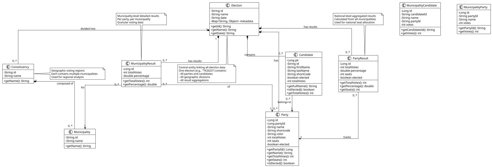
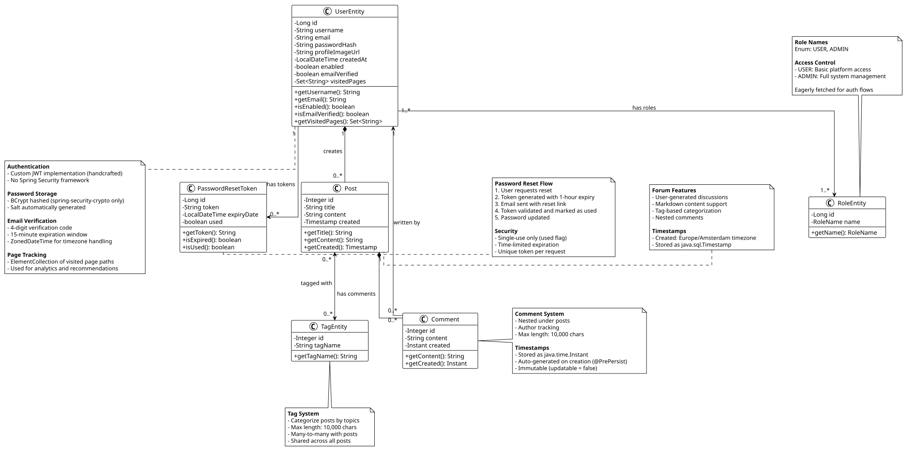
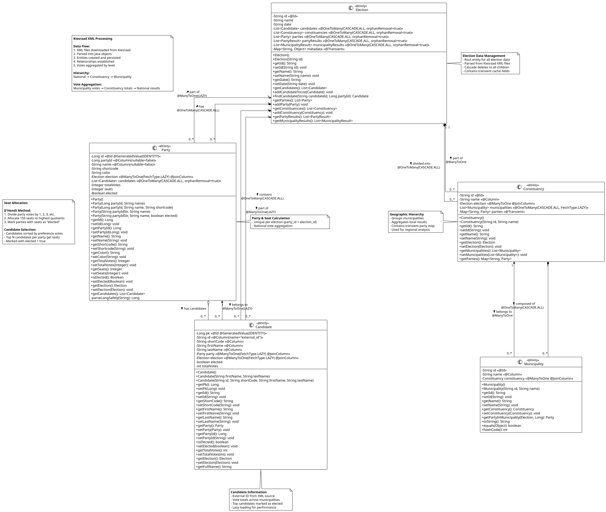
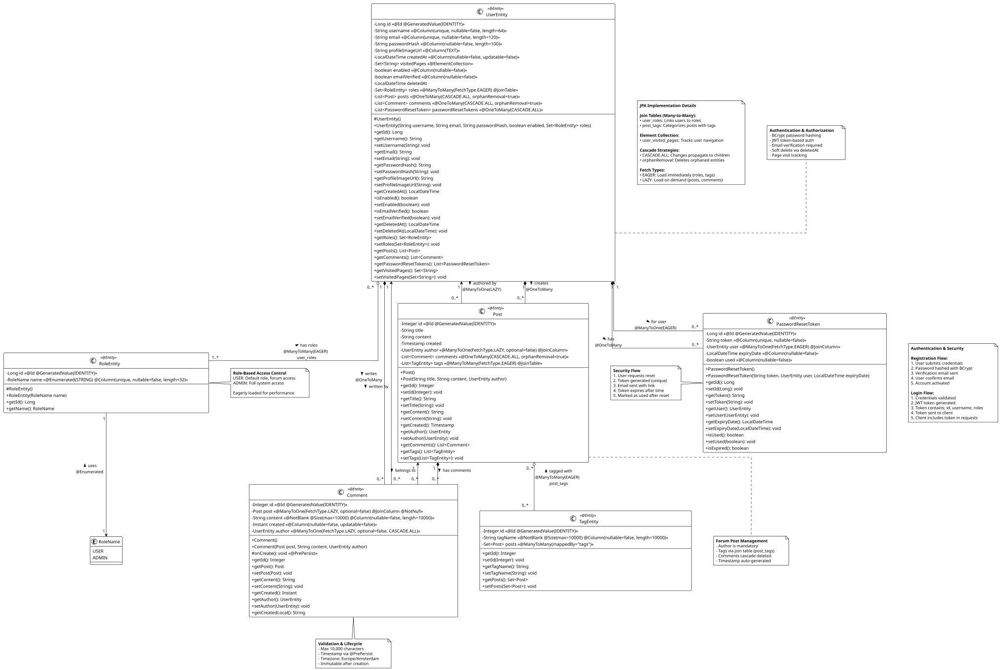

# StemWijs UML Class Diagrams

## Overview

This document explains the UML diagrams for the StemWijs election platform. The diagrams are organized at two levels:

1. **Domain Models** (Conceptual) - High-level business entities for all stakeholders
2. **Implementation Diagrams** (Technical) - Detailed Java/JPA implementation for developers

Both levels are split into two domains for clarity:
- **Election Domain** - Election data and results
- **User & Community Domain** - User management, authentication, and forum features

---

## Domain Models (Conceptual)

**Purpose:** High-level overview of business entities and their relationships  
**Audience:** Everyone (stakeholders, developers, product owners)  
**Technology:** Independent (can be implemented in any language)

### Election Domain Model


*Complete UML source: [ElectionDomain.puml](ElectionDomain.puml)*

**Shows:** Election, Party, Candidate, Constituency, Municipality and their relationships

---

### User & Community Domain Model


*Complete UML source: [UserDomain.puml](UserDomain.puml)*

**Shows:** UserEntity, RoleEntity, Post, Comment, TagEntity, PasswordResetToken and their relationships

---

## Implementation Diagrams (Technical)

**Purpose:** Complete Java/JPA implementation with all technical details  
**Audience:** Developers and technical reviewers  
**Technology:** Java, Jakarta Persistence (JPA), Hibernate

### Election Implementation Diagram


*Complete UML source: [ElectionImplementation.puml](ElectionImplementation.puml)*

**Package:** `nl.hva.dederdekamer.election_backend.XMLParser.model`

**Shows:**
- All JPA annotations (@Entity, @Id, @ManyToOne, @OneToMany, etc.)
- Database column mappings and constraints
- Cascade strategies (CASCADE.ALL, orphanRemoval)
- Fetch types (LAZY/EAGER)
- Complete method signatures
- Kiesraad XML data processing flow
- D'Hondt seat calculation method

**Key entities:** Election, Party, Candidate, Constituency, Municipality

---

### User & Forum Implementation Diagram


*Complete UML source: [UserImplementation.puml](UserImplementation.puml)*

**Package:** `nl.hva.dederdekamer.election_backend.entities`

**Shows:**
- All JPA annotations and validation constraints
- Authentication & security implementation (BCrypt, JWT)
- Role-based access control (RBAC)
- Database relationships and join tables
- Bean validation rules (@NotNull, @Size, etc.)
- Complete method signatures
- Authentication flow details
- Password reset security flow

**Key entities:** UserEntity, RoleEntity, Post, Comment, TagEntity, PasswordResetToken

---

## Diagram Overview

| Diagram | Type | Scope | Audience | Level |
|---------|------|-------|----------|-------|
| `DomainModel.puml` | Conceptual | Complete system | Everyone | Business |
| `ElectionDomain.puml` | Conceptual | Election only | Everyone | Business |
| `UserDomain.puml` | Conceptual | User/Forum only | Everyone | Business |
| `ElectionImplementation.puml` | Technical | Election only | Developers | Implementation |
| `UserImplementation.puml` | Technical | User/Forum only | Developers | Implementation |

---

## Why Separate Diagrams?

**For both Domain Models and Implementation Diagrams:**

- **Clarity**: Each domain has a clear, focused purpose
- **Maintainability**: Changes to one domain don't clutter the other
- **Scale**: Prevents diagrams from becoming too large and complex
- **Readability**: Easier to understand and review specific subsystems
- **Print-friendly**: Each diagram fits well on a single page

**Domains are independent:**
- Election domain manages data parsing and storage
- User domain manages authentication and community features
- Minimal cross-domain dependencies

---

## Domain Model vs Implementation Diagram

### What's the Difference?

| Aspect | Domain Model | Implementation Diagram |
|--------|--------------|------------------------|
| **Purpose** | Show business concepts | Show technical implementation |
| **Audience** | Everyone | Developers only |
| **Abstraction** | High (conceptual) | Low (concrete code) |
| **Technology** | Independent | Java/JPA specific |
| **Details** | Essential attributes | All fields + annotations |
| **Methods** | Key operations | Complete signatures |
| **Annotations** | None | All JPA/validation |

### When to Use Which?

**Use Domain Model for:**
- Explaining the system to stakeholders
- Project planning and design discussions
- Understanding business logic
- Onboarding new team members

**Use Implementation Diagram for:**
- Code reviews and technical documentation
- Database schema design
- Understanding JPA relationships
- Debugging performance issues
- Showing technical expertise to instructors
---

## Purpose

### Election Domain Model

Manages all election-related data parsed from official XML files provided by the Kiesraad (Dutch Electoral Council):

- **Election structure** - Elections, constituencies, municipalities
- **Political entities** - Parties and candidates
- **Results aggregation** - National and municipal vote counts
- **Geographic hierarchy** - Constituency → Municipality relationships

### User & Community Domain Model

Manages user accounts, authentication, and community engagement:

- **User management** - Accounts, profiles, page tracking
- **Authentication** - JWT tokens, email verification, password resets
- **Authorization** - Role-based access control (USER/ADMIN)
- **Community features** - Forum posts, comments, and tags

## Main Components

### Election Domain Components

#### Geographic & Structural Entities:

**Election**
- Represents a complete election event (e.g., "Tweede Kamer 2025")
- Contains metadata like election date and name
- Acts as the root for all election-related data

**Constituency (Kieskring)**
- Geographic voting regions
- Contains multiple municipalities
- Used for regional vote analysis

**Municipality (Gemeente)**
- Smallest geographic unit in the system
- Belongs to one Constituency
- Represents a single voting jurisdiction

#### Political Entities:

**Party**
- Political parties participating in the election
- Tracks name, shortcode, color, and national results
- Contains total votes received and seats won
- `elected` flag indicates parliamentary representation

**Candidate**
- Individual candidates running for election
- Belongs to exactly one Party (normalized design)
- Tracks personal vote count and election status
- Contains name, short code, and party affiliation

#### Results Aggregation:

**PartyResult**
- National-level aggregated results per party
- Calculated from all municipalities
- Stores total votes, percentage, and seat allocation
- Used for national overview and seat distribution

**MunicipalityResult**
- Municipality-level detailed results
- Tracks votes per party per municipality
- Provides granular voting data for analysis
- Links to both Municipality and Party

**MunicipalityCandidate & MunicipalityParty**
- Municipality-specific candidate and party data
- Used during XML parsing and local result tracking
- Separate from national aggregation entities

#### Design Decisions:

**Normalized party references:**
- Candidates reference Party entity (not duplicate party name)
- Ensures party information is always consistent

**Separate result aggregations:**
- PartyResult for national overview
- MunicipalityResult for local granularity (used in map visualization)
- Clear separation between summary and detailed data

**Geographic hierarchy:**
- Election → Constituency → Municipality
- Supports regional analysis and filtering
- Matches official Kiesraad data structure

### User & Community Domain Components

#### User Management:

**UserEntity**
- Represents a registered user account
- Stores username, email, and password hash (BCrypt)
- Tracks profile image URL and account creation date
- Page tracking via `visitedPages` collection
- `enabled` flag controls account activation (email verified)
- `emailVerified` flag tracks verification status

**RoleEntity**
- Defines user permissions (USER or ADMIN)
- Uses enum: `RoleName { USER, ADMIN }`
- Many-to-many relationship with UserEntity
- Enables role-based access control (RBAC)

**PasswordResetToken**
- Manages password reset requests
- Time-limited tokens (1-hour expiration)
- Single-use only (`used` flag prevents replay attacks)
- Links to UserEntity for validation

#### Community Features:

**Post**
- Discussion topic created by a user
- Contains title and content
- Timestamp in Europe/Amsterdam timezone
- Can have multiple comments and tags
- Belongs to one UserEntity (author)

**Comment**
- Reply to a specific Post
- Written by one UserEntity
- Contains text content (max 10,000 chars)
- Timestamp auto-generated on creation
- Immutable creation timestamp

**TagEntity**
- Categorization system for posts
- Many-to-many relationship with posts
- Enables topic-based filtering
- Reusable across multiple posts

#### Authentication & Security:

**Authentication Flow:**
1. User registers -> account created with `enabled=false`
2. 4-digit verification code sent via email (15-minute expiration)
3. User verifies -> `enabled=true`, `emailVerified=true`
4. User logs in -> JWT token issued
5. JWT token used for all authenticated requests

**Security Features:**
- **Custom JWT implementation** - Handcrafted, not Spring Security framework
- **BCrypt password hashing** - Uses only spring-security-crypto library
- **Email verification** - 4-digit codes with ZonedDateTime expiration
- **Password reset** - Time-limited single-use tokens
- **Role-based access control** - USER vs ADMIN permissions

## Relationships Explained

### Election Domain Relationships

```
Election (1) ──── contains ───> (0..*) Candidate
Election (1) ──── has ───> (0..*) Party
Election (1) ──── divided into ───> (0..*) Constituency
Election (1) ──── has results ───> (0..*) PartyResult
Election (1) ──── has results ───> (0..*) MunicipalityResult

Candidate (0..*) ──── belongs to ───> (1) Party
Constituency (1) ──── composed of ───> (0..*) Municipality
PartyResult (0..*) ──── tracks ───> (1) Party
MunicipalityResult (0..*) ──── for ───> (1) Municipality
MunicipalityResult (0..*) ──── of ───> (1) Party
```

**Why these relationships:**
- **Election as root aggregate**: Everything belongs to one election event
- **Candidate → Party**: Ensures candidate party information is always consistent
- **Constituency → Municipality**: Geographic hierarchy for regional analysis
- **Result entities**: Separate national (PartyResult) and local (MunicipalityResult) aggregations

### User & Community Domain Relationships

```
UserEntity (1) ──── creates ───> (0..*) Post
UserEntity (1) ──── writes ───> (0..*) Comment
UserEntity (1..*) ←──── has roles ───> (1..*) RoleEntity
UserEntity (1) ──── has tokens ───> (0..*) PasswordResetToken
Post (1) ──── has comments ───> (0..*) Comment
Post (0..*) ←──── tagged with ───> (0..*) TagEntity
Comment (0..*) ──── written by ───> (1) UserEntity
```

**Why these relationships:**
- **User → Post/Comment**: Track authorship for moderation and user profiles
- **User ↔ Role**: Many-to-many for flexible permission assignment
- **User → PasswordResetToken**: One-to-many for password recovery flow
- **Post → Comment**: Composition - comments belong to parent post
- **Post ↔ Tag**: Many-to-many for flexible categorization

## Database Implementation

These UML diagrams map directly to database tables via JPA (Java Persistence API):

- Each **class** = one database table
- Each **attribute** = one table column
- Each **relationship** = foreign key or join table

## Data Flow Examples

### Example: Viewing Election Results

1. User visits `/results` page
2. Frontend requests: `GET /api/elections/TK2023`
3. Backend queries Election table → finds election by ID
4. Backend loads related Parties (via JPA relationship)
5. Backend returns JSON with complete election data
6. Frontend displays parties and seats

### Example: Creating a Forum Post

1. User clicks "New Post" button
2. User fills in title and content
3. Frontend sends: `POST /api/posts` with JWT token
4. Backend validates JWT → extracts username
5. Backend finds UserEntity by username
6. Backend creates new Post entity, links to UserEntity
7. Backend saves Post to database
8. Backend returns created Post to frontend
9. Frontend shows new post in forum list


## Technical Notes

### Lazy vs Eager Loading:

**Election Domain:**
- Most relationships: `LAZY` (load on demand for performance)
- Election → Parties/Candidates: `LAZY` (loaded when needed)
- MunicipalityResult → Municipality/Party: `LAZY`

**User & Community Domain:**
- User → Roles: `EAGER` (always needed for authentication/authorization)
- Post → Comments: `LAZY` (only load when viewing post details)
- Post → Tags: `EAGER` (needed for display in lists)
- User → Posts/Comments: `LAZY` (profile page loads separately)

## Related Documentation

- [API Documentation](../api_documentation.md) - REST endpoints that use these entities
- [Database Changes](../DATABASE_STRUCTURE_CHANGES.md) - Schema evolution history
- [Authentication Guide](../technical/Aydin/authentication_system_setup_guide.md) - How JWT works with UserEntity

---

**Last Updated:** November 2025 (Sprint 4)  
