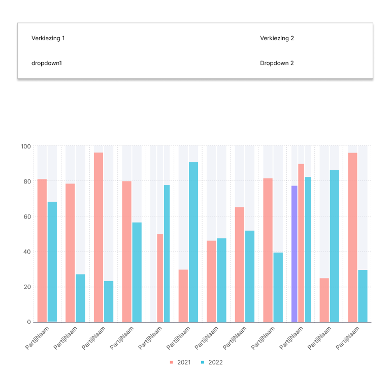

# TMC-Cyclus 1 Layout vergelijkingspagina

---

## THINK

### Doel

Een eerste versie van een vergelijkingspagina ontwikkelen waarop gebruikers de verschillen in partijresultaten tussen
twee Tweede Kamerverkiezingen kunnen bekijken.

### Activiteiten

- Analyse van andere populaire vergelijkingssites zoals
    - NOS Verkiezingen (interactieve uitslagen, zetelverdeling, delta’s tussen jaren)
    - Kiesraad / officiële uitslagen (brongegevens, betrouwbaarheid)
    - Wikipedia (detailpagina's per verkiezing met tabellen en grafieken)
    - Kieskompas / Stemwijzer (gebruiksvriendelijke interfaces voor politieke voorkeuren)
- Feedback gevraagd aan 1 medestudent, 1 familielid (broertje van 18) en een docent.
- 2 schetsen gemaakt van de potentiele vergelijkingspagina en gevraagd aan de feedbackgevers welke ze het beste vonden
  en wat er aangeepast kan worden

### Belangrijkste Inzichten

- Gebruikers moeten gelijk inzicht kunnen hebben over de functionaliteiten van de pagina
- De layout moet eenvoudig en overzichtelijk zijn voor eerste indrukken.

### Epic en user stories

---

## MAKE

### Wat is gemaakt

- De 2 schetsen van hoe de pagina eruit kan zien.

### Designkeuzes

- Een sectie waar je de 2 jaren die je wilt kan selecteren om ze te vergelijken
- Een zetelverdeling staafdiagram waar je per partij het aantal zetels kan bekijken van de 2 gekozen jaren

---

## CHECK

### Wat is getest

- Vinden gebruikers de inhoud duidelijk?
- ziet de pagina er vriendelijk uit?
- Begrijpen gebruikers wat ze kunnen doen op de pagina?
- Begrijpen gebruikers de grafiek en wat de kleuren betekenen?

### Testpersonen

- 3 gebruikers: 2 medestudentrn, 1 persoon buiten het vakgebied (mijn broertje). Hij is 18 jaar en heeft geen ervaring
  met
  softwareontwikkeling of gerelateerde kennis.

Ik heb de homepage laten testen door mijn broertje, die geen ervaring heeft met softwareontwikkeling of gerelateerde
kennis.
Hierdoor krijg ik beter inzicht in de behoeften en verwachtingen van een gemiddelde gebruiker.

### Testscenario

- Je komt op de pagina, wat zou je as eerst doen?
- Je ziet de dropdowns om jaren te kiezen, begrijp je wat je kunt doen?
- Je ziet de staafdiagram, begrijp je wat de gegevens voorstellen?
- Vind je de pagina overzichtelijk en duidelijk?

### Resultaten

| Taak                               | Resultaat        | Problemen                                                   | Verbeterideeën                                                                                                              |
|------------------------------------|------------------|-------------------------------------------------------------|-----------------------------------------------------------------------------------------------------------------------------|
| Jaren selecteren voor vergelijking | 3 van 3 voltooid | Label en placeholder van het keuzeveld missen               | Voeg duidelijke placeholders toe, zoals “Kies jaar (standaard: laatst & vorige)”, en een korte hulptekst onder de dropdowns |
| Begrip van staafdiagram            | 3 van 3 begrepen | Legenda en kleurcodering kan iets duidelijker               | Gebruik consistente kleuren, voeg een legenda toe en overweeg hover-tooltips met absolute en procentuele waarden            |
| Begrip van sorteervolgorde         | 1 van 3 begrepen | Onduidelijk of partijen op winst of verlies gesorteerd zijn | Voeg een zichtbare sorteervlag of toggle toe: “Sorteer op grootste winst / grootste verlies”                                |
| Overzichtelijkheid van layout      | 3 van 3 positief | Geen grote problemen, maar context mist nog wat             | Voeg een korte inleidende zin toe boven de dropdowns die uitlegt wat de gebruiker hier kan doen                             |

### Gebruikersfeedback

Feedback van Student Batuhan:

- De pagina ziet er netjes uit, maar ik mis wat uitleg over wat ik hier kan doen.
- De kleuren in de grafiek zijn een beetje verwarrend, misschien kun je een legenda toevoegen.

Feedback van student Zoiye:

- De pagina ziet er best simpel uit qua inhoud. Ik raad je aan om een nieuwe sectie toe te voegen waar je
  overzichtelijke tabelsectie toevoegt met kolommen voor `Partij`, `Zetels (jaar A)`, `Zetels (jaar B)`,
  `Verschil (abs)`, `Verschil (\%)` en misschien een korte toelichting.

Feedback van mijn broertje:
- Ik snap wel wat ik hier kan doen, maar ik zou het fijner vinden als er een korte uitleg staat.
- De grafiek is wel duidelijk, maar ik zou het fijn vinden als de data ook in een tabelvorm beschikbaar is.

### To be continued