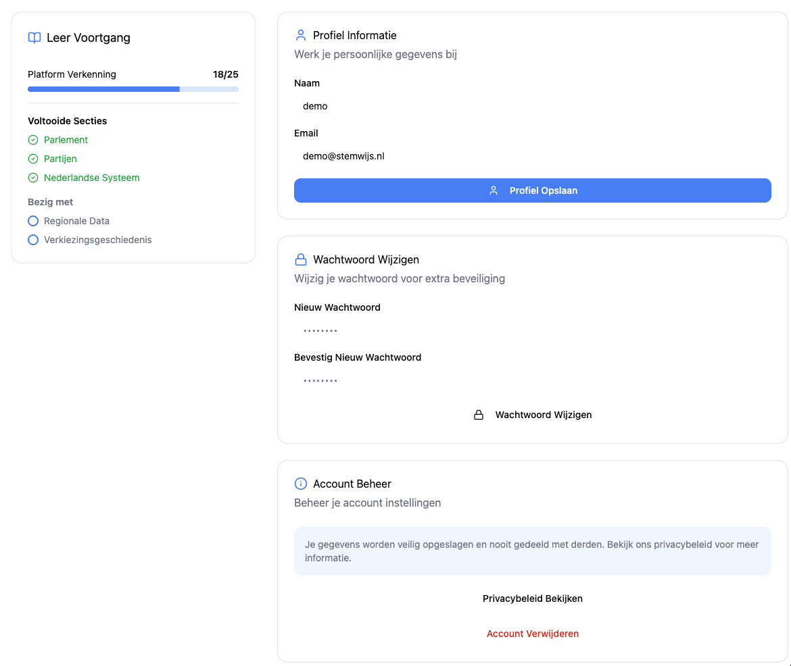
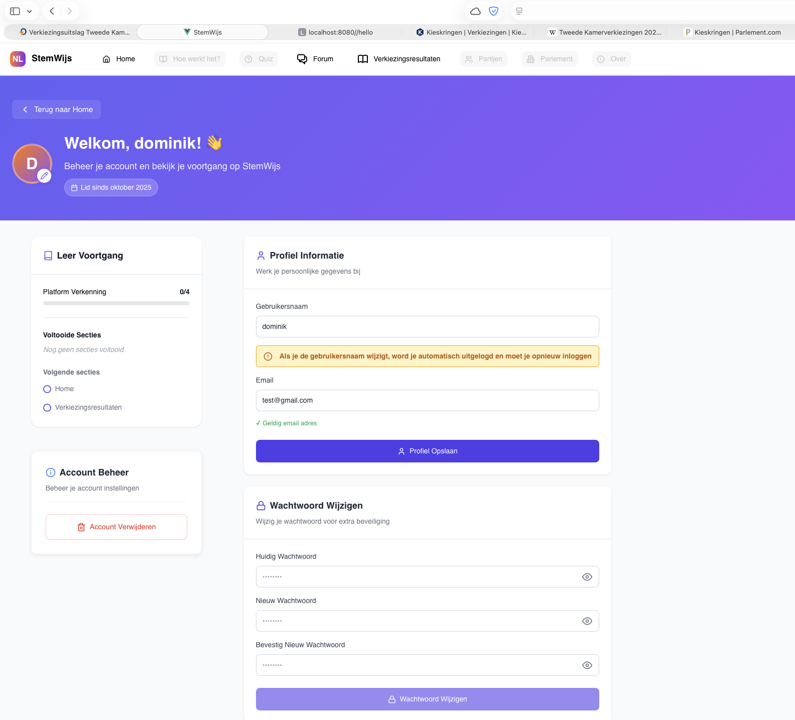
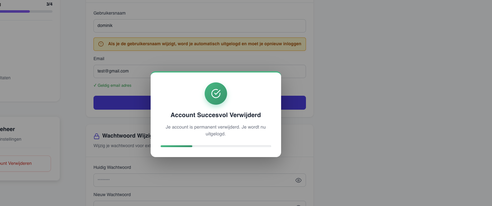

# TMC Cycle 1
## THINK
**Goal:** Create an easy-to-use and secure profile page where users can update their personal details, change their password, delete their account, and see their platform exploration progress.

- **Target audience:** Registered users of the platform. These users need straightforward account management and motivating progress indicators.
- **Research methods:**
  - Desk research on common patterns for profile/account UX.
  - Quick competitive scan of modern apps (e.g., education platforms, government portals).
  - Short moderated usability sessions with three testers to validate core flows.
- **Key insights:**
  - Users expect instant, clear feedback (toasts, confirmations) when they update settings.
  - Critical actions (delete account) should be confirmable and reversible only after explicit consent.
  - Visual progress tracking increases engagement.

## MAKE
**Goal:** Implement a first working prototype composed of modular Vue components.

- **What was built:**
  - `ProfilePage.vue` — overall layout and orchestration.
  - `ProfileInformation.vue` — edit username and email with validation and toast feedback.
  - `ChangePassword.vue` — change password with strength checks and confirmation.
  - `AccountManagement.vue` — privacy info and delete-account flow (confirmation modal).
  - `LearningProgress.vue` — shows trackable pages and progress bar ("Platform Verkenning"): this component tracks which section pages the user has visited, displays a progress bar, completed sections and next suggested sections. This was an extra feature implemented by the author and is highlighted in the tests — a point of pride for the team.
- **Design choices and rationale:**
  - Card-based UI to separate concerns and make the layout scannable.
  - Toast notifications for non-blocking success/error messages.
  - Modal for dangerous actions (delete account) to force an explicit confirmation.

### Prototype (Cycle 1)
_Figma prototype used for initial usability tests._

- Screenshot: 

- Notes: The prototype is interactive in Figma and was the basis for the user tasks in Cycle 1.

## CHECK
**Goal:** Run consistent usability tests to collect actionable feedback.

**Test plan (same for every tester):**
All testers received the exact same task list and context. They were given a demo account and asked to perform the following steps in the prototype:

1. Open the Profile page.
2. Change your display name, save changes, and observe feedback.
3. Change your email address to a valid new address and save changes.
4. Attempt to set an invalid email (e.g., "bad-email") to check validation behavior.
5. Change your password: choose a new password that is strong enough, confirm, and save.
6. Attempt to change password using a too-short password to check validation errors.
7. Visit several trackable pages (for example: Home, Verkiezingsresultaten, Forum) to increase the Platform Verkenning progress and observe the `LearningProgress` card update (completed count, percentage, and "next sections").
8. Open Account Management and trigger the delete account flow; confirm deletion in the modal and observe confirmation behavior.

**Testers:**
- Tester 1 — Carlos (student)
- Tester 2 — Mara (student)
- Tester 3 — Bryan (student)

**Observations and feedback (translated to English):**
- Carlos:
  - "The workflow is easy to understand, but I miss a confirmation message after saving changes." (when saving name/email)
  - "It would be safer if I had to enter my current password before setting a new password." (regarding password change)
  - "I like seeing my progress, it motivates me to explore more of the site." (about Platform Verkenning / Learning Progress)
  - "It would be cool to change my profile photo — that would make my profile feel more personal." (suggestion about profile photo)
- Mara:
  - "The input fields are well placed, but the save button should be bigger and more prominent." (visual/button prominence)
  - "Validation messages appear useful but could be clearer in wording." (validation clarity)
  - "Uploading a profile photo would be a nice touch" (profile photo suggestion)
- Bryan:
  - "It would help to see explicit error messages when I type an invalid email or a too-short password." (validation feedback)
  - "The delete account confirmation is clear, but a visible progress indicator during deletion would be reassuring." (delete flow feedback)
  - "Seeing the completed sections and suggested next sections makes it clear what to do next on the platform." (about LearningProgress)

**What worked well:**
- The modular layout made the flows easy to find and test.
- Toasts and modals provided immediate, contextual feedback.

**Issues identified / actionable improvements for Cycle 2:**
1. Add clear confirmation toast after saving profile changes.
2. Require current password when changing password (security).
3. Make the Save button larger and more prominent.
4. Improve validation messaging to be explicit and actionable.
5. Add a visible progress/countdown indicator for critical actions like account deletion.
6. Add profile photo upload: client-side validation, immediate preview, and a loading state while the image uploads.

---

# TMC Cycle 2
## THINK
**Reflection on Cycle 1:**
- Users liked the overall structure but requested stronger visual feedback for saved changes, stronger validation messages, and a clearer deletion feedback mechanism.

**Goals for Cycle 2:**
1. Address all high-priority feedback from Cycle 1.
2. Add a progress indicator during account deletion and a confirmation toast after save.
3. Add profile photo upload functionality.

## MAKE
**Implemented improvements:**
1. Confirmation toast after saving profile changes (green success toast with clear copy: "Changes saved successfully").
2. Current-password requirement enforced when changing password (UI label and validation).
3. Enlarged and restyled Save button for better discoverability.
4. Improved validation messages (explicit guidance: "Password must be at least 8 characters, include a number and a capital letter").
5. Animated progress bar/countdown in the deletion success toast: shows a 2.5 second countdown before redirect/logout.
6. Profile photo upload: added avatar upload button in the header, client-side checks (image type, max 5 MB), immediate preview, and an upload spinner to indicate activity.
7. LearningProgress improvements: real-time update when users visit pages (event-based), clearer labels for completed/in-progress sections, and exclusion of placeholder pages (e.g., `/privacy-policy`) from tracking until they exist server-side.

**How changes were validated manually by the team:**
- Developer walkthrough to confirm the flows work and that the toast + progress bar appear for the deletion flow.

### Implemented version (Cycle 2)
_See the implemented changes in the screenshot below._

Below: Profile page with updated flows, including profile photo upload and improved feedback mechanisms.

Below: Account deletion progress bar during the deletion process before redirect.

## CHECK
**User validation (same testers and same tasks):**
We asked the same three testers (Carlos, Mara, Bryan) to run the identical task list used in Cycle 1, focusing on the updated flows and visual feedback.

**Results and verbatim feedback (translated to English):**
- Carlos:
  - "The confirmation message after saving is clear — I no longer wonder if my changes were applied." (positive)
  - "Requiring the current password makes me feel safer." (security)
  - "I can now change my profile photo and see it directly in the navigation bar, which is great!" (profile photo)
- Mara:
  - "The save button stands out now and makes the flow much more straightforward." (visual)
  - "Validation messages are clearer, telling me exactly what to fix." (validation)
- Bryan:
  - "The progress bar during account deletion is helpful; I can see when the redirect will happen." (delete flow)
  - "Photo upload works smoothly, and I like seeing my updated avatar right away." (profile photo)

**What improved:**
- Confirmation feedback and deletion countdown addressed the main concerns.
- Validation errors were clearer and actionable.
- Button prominence and mobile spacing improved discoverability and comfort.
- Profile photo upload was well-received and added a personal touch.

**Remaining notes / follow-ups:**
1. Implement the actual privacy-policy page (currently a placeholder). Ensure it is excluded from learning-progress tracking until the page exists in the backend.
2. Consider adding an undo or recovery step for account deletion in a future iteration (e.g., 30-day soft-delete).

**Final reflection:**
The two TMC cycles show a clear iterative improvement: the profile page is now more user-friendly and secure. Testers confirmed the key fixes; The prototype is ready for presentation to the Product Owner for evaluation and next-step decisions.